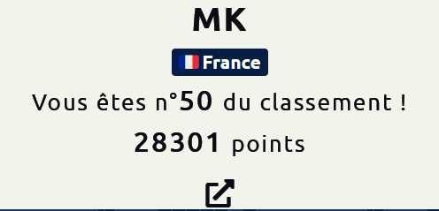

# CTF 404 / 2022

CTF organisé du 16 mai au 10 juin 2022 par Télécom SudParis.

Merci aux organisateurs pour ces challenges variés, le gros travail de préparation mais aussi la qualité du support tout au long du challenge (un peu long d'ailleurs ... dur de rester dans le rythme pendant un mois !!!)

Voici quelques Write Up :

- #### Forensic
  - [Raid 1/2](forensic/raid_1)
  - [Raid 2/2](forensic/raid_2)
- #### Miscellaneous
  - [Pierre Papier Hallebarde](misc/pierre_papier_hallebarde)
  - [Utilisateur suspect 1/2](misc/suspect_user_1)
  - [Utilisateur suspect 2/2](misc/suspect_user_2)
  - [Je suis une théière](misc/teapot)
  - [GoGOLFPlex](misc/gogolfplex)
- #### OSINT
  - [A l'aube d'un échange](osint/aube)
  - [Collaborateur suspect](osint/collab_suspect)
  - [Nous sommes infiltrés](osint/infiltres)
  - [Nom d'une nouvelle recrue](osint/nom_nvelle_recrue)
- #### Programmation
  - [Découpé](programmation/decoupe)
  - [Compression](programmation/compression)
- #### PWN
  - [Cache cache](pwn/cache_cache)
  - [Patchwork](pwn/patchwork)
  - [Sans protection](pwn/sans_protection)
  - [Trop Facile](pwn/trop_facile)
  - [Coffre fort](pwn/coffre_fort)
- #### Reverse
  - [Renverse la tour 1/2](reverse/tour_1)
  - [Renverse la tour 2/2](reverse/tour_2)
- #### Cryptanalyse
  - [Weak Signature](crypto/weak_sign)
  - [Un simple oracle 1/2](crypto/oracle_1)
  - [Un simple oracle 2/2](crypto/oracle_2)
  - [La Fonte des hashs](crypto/fonte_hash)
  - [Un point c'est tout](crypto/point)

### End game

  

