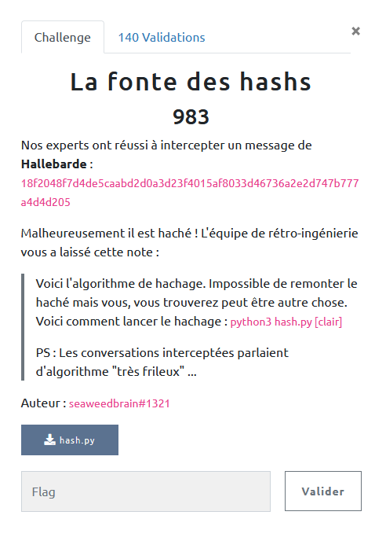

## CRYPTANALYSE / La fonte des hashs

<p align="center">
  
</p>


### Look around


Le challenge nous fournit un fichier :
- [hash.py](hash.py) : code utilisé pour hasher des chaînes de caractère
- un hash (le flag sûrement) hashé par cet algorithme : `18f2048f7d4de5caabd2d0a3d23f4015af8033d46736a2e2d747b777a4d4d205`

Le fichier fournit est relativement obfusqué, mais un peu de recherche sur `eval()`  et `codecs.decode()` permet de rapidement reconstituer un code lisible, en gros :

`base64.b64decode( magic + ROT13(love) + god + ROT13(destiny) )`

Ce qui nous donne alors le fichier [hash_readable.py](hash_readable.py)

### Analyse du code

En première approche l'analyse statique du code est possible, pour essayer de déceler une faiblesse dans l'algorithme, mais on peut bien plus simplement et rapidement s'en rendre compte en faisant tourner le script sur quelques inputs choisis :

```bash
$ python3 hash_readable.py A
830909097c636363636363636363636363636363636363636363636363636363
$ python3 hash_readable.py AA
83637c7c097c6363636363636363636363636363636363636363636363636363
$ python3 hash_readable.py AAA
836383097c097c63636363636363636363636363636363636363636363636363
$ python3 hash_readable.py AAAA
83638363097c097c636363636363636363636363636363636363636363636363
$ python3 hash_readable.py AAAAA
8363836363097c097c6363636363636363636363636363636363636363636363
```

On se rend compte que la sortie est relativement 'stable', modifier un caractère ne modifie pas radicalement le hash ... Le début du hash reste consistant avec le début de notre input.

Avec un test un peu plus choisi :

```bash
python3 hash_readable.py "404CTF{"
18f2048f7d4de545ebda7c636363636363636363636363636363636363636363
```

Là on retrouve carrément le début du hash fournit en indice.

### Breaking the hash

L'idée est alors simplement de bruteforcer les caractères de l'input pour reconstituer le hash du challenge :

```python
target = "18f2048f7d4de5caabd2d0a3d23f4015af8033d46736a2e2d747b777a4d4d205"
plain =  "404CTF{"


print(h(plain)[:2*len(plain)] == target[:2*len(plain)])

while True:
    for c in string.printable:
        tmp = plain + c
        if h(tmp)[:2*len(tmp)] == target[:2*len(tmp)]:
            plain += c
            print(plain)
```
Et de laisser tourner quelques secondes [hash_break.py](hash_break.py) pour récupérer notre flag :

```bash
$ python3 hash_break.py
True
404CTF{y
404CTF{yJ
404CTF{yJ7
404CTF{yJ7d
404CTF{yJ7dh
404CTF{yJ7dhD
404CTF{yJ7dhDm
404CTF{yJ7dhDm3
404CTF{yJ7dhDm35
404CTF{yJ7dhDm35p
404CTF{yJ7dhDm35pL
404CTF{yJ7dhDm35pLo
404CTF{yJ7dhDm35pLoJ
404CTF{yJ7dhDm35pLoJc
404CTF{yJ7dhDm35pLoJcb
404CTF{yJ7dhDm35pLoJcbQ
404CTF{yJ7dhDm35pLoJcbQk
404CTF{yJ7dhDm35pLoJcbQkU
404CTF{yJ7dhDm35pLoJcbQkUy
404CTF{yJ7dhDm35pLoJcbQkUyg
404CTF{yJ7dhDm35pLoJcbQkUygI
404CTF{yJ7dhDm35pLoJcbQkUygIJ
404CTF{yJ7dhDm35pLoJcbQkUygIJ}
```

### L'implémentation d'algorithmes cryptographiques "maison" est une très mauvaise idée !!
