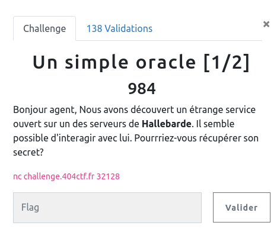

## CRYPTANALYSE / Un point c'est tout

<p align="center">
  
</p>


### Look around

Nous avons à disposition une interface pour interagir avec un oracle :

```bash
nc challenge.404ctf.fr 32128
Voici le message secret que je dois garder. Vous pouvez le voir, de toute façon vous ne pourrez rien en faire!
17769259699510083968731395849315084977766936543546994606009559958682723023166565947631642533448586605375673975163484611204787593721914332310980330360720297694579782458760224690781790611746079583156072678332707860934339028743045315004629164459328918097429049984366517802522610941201961404287804608456868133471963476581165006556881638173223866041273815231340776295257797556895141093568591014773120233407954509200728946933592629675601710949217905186565817122539032332446276662390022214056602725298656173467242159060165754278317758225424377409967678499083721896860666995761220342567965732987874857557701199681410626067452
J'en profite également pour noter quelques informations ici:
N = 19355616721214337194345252587458343813900526593430122866396152880849460758293898507232727439811255887886414572362453139272047298475765058507971560559756944967161371383168926651157513643875806035769272751232075865894131961247878765015504199988688162899672554505964779040312763308139212823296278704628095459049388437155834999451515379348901563087892075256823871165332568151568172944033050324212053682777032343958066759787734433344740780953808936846549845635550633301280010008832470511875455657791858808602878511607885612853501654200318552036392477486407351201074631526369644725009336903329465846652886673477226372540339
e = 65537

Ceci étant dit, passons à ce que vous vouliez me dire!

>
```

A priori un oracle de déchiffrement, nous pouvons lui soumettre un message chiffré, et il le déchiffre pour nous ... sauf le flag (ça serait trop facile !!).

Il suffit de faire quelques tests, pour s'en rendre compte :
- envoyer le flag : message d'erreur
- envoyer un message chiffré avec (e,N) : message clair

### Attaque

Par chance nous avons la clef publique à disposition. On peut choisir un message `known` et le chiffrer : `knwon^e [N]`

On soumet alors à l'oracle : `(knwon^e) * (flag^e) = (knwon * flag)^e`

L'oracle nous retourne alors `(knwon * flag)^e^d = (knwon * flag)` où `d` est la clef privée.

Il reste plus qu'à multiplier par l'inverse de `knwon` pour récupérer le flag.

Avec le code suivant :

```python
from binascii import unhexlify
from Crypto.Util.number import inverse
import socket


def send_bytes(s, b):
	s.send(b.encode() + b'\n')
	rep = s.recv(2048)
	return rep


HOST = 'challenge.404ctf.fr'
PORT = 32128

with socket.socket(socket.AF_INET, socket.SOCK_STREAM) as s:
    s.connect((HOST, PORT))

    rep = s.recv(2048)

    cipher_flag = int( rep.split(b'\n')[1].decode() )
    N = int( rep.split(b'\n')[3][4:].decode() )

    e = 65537

    print(f'{cipher_flag=}')
    print(f'{N=}')
    print(f'{e=}')

    # chosen plain text
    k = 5
    known = pow(k,e,N)

    rep = send_bytes(s, str(cipher_flag*known) )
    rep = int(rep.split(b'\n')[1].decode())

    inv = inverse(rep,N)

    flag = inverse(inv * k,N)
    flag = hex(flag)[2:]
    print(unhexlify(flag))
```


```bash
python3 solve_oracle_1.py
cipher_flag=21198353547407397210250581202757444083880640467249502818978186177701291446543591671380632394546552453468099475912504277616901048123493512731436043041262514799938658816454605478928814583641307022140302346672124245323728354727305889437056685450640076409492896102204593532082640866526597499360560899834867702428306420089614451283990494755156267450911004940482252253099912485672043227534420077925717787857166930652051387383265540948355947668544951266123062381336878486373134861134515793923683882390643862905371493031554279781595901714603476239144193978805699703885606880422765780156583245677261440573603696111254114035190
N=25322016711999466707450485835315332199395645340207447061557215779048537225363598004921490824242801357299514788676778276352411751614626656457817997113772147972847769312524383818342309103922928786400760013080848340858749696756180186211326802056225219517549559473419854659191757335021939001673098700801418302049330617069297406350635495159570641065650565945882828644088408552886896466243581008152377596104548842722262401635338911080565539193537704391633802500368666191648839440594231874313111284861613876812808866512347439191128659051937970104517322516267947244230740640091062705854471407223300548251059869341193920212399
e=65537
b'404CTF{L3s_0r4cl3s_RSA_s0n7_si_fr4g1l35}'
```
