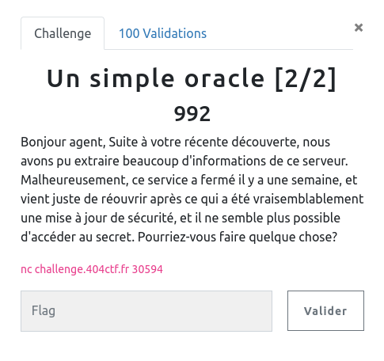

## CRYPTANALYSE / Un simple oracle 2/2

<p align="center">
  
</p>


### Look around

Nous avons à disposition une interface pour interagir avec un oracle :

```bash
nc challenge.404ctf.fr 30594
Il y a eu quelques petits problèmes lors de ma précédente itération, mais tout a été résolu!
Je peux à nouveau montrer mon secret sans craintes:
13435527312294828021115881312461451395375023001653703543403206511753763113496654560120146408373365455082237148285101364314027962495630186533764053724152066266633639483143473093224727339760280145019163520354387240958578326378800141350304841617939769279398745050671110948559260833541568994481529592654514878158546352332029737418044531992956977701504671509395670118875303497638634692841899684741670033398059327380595823997081562350504507007306326756807487193533438113881506299816680185106886859449830936179562088969925647038822672208635965865546530558286111134715621020267805496148394818852595099608886572106234980519872
Par mesure de sécurité, je ne peux malheureusement plus tout partager ici:
e = 65537

Ceci étant dit, passons à ce que vous vouliez me dire!

>
```


On se retrouve dans un situation similaire au challenge n°1, mais cette fois sans divulgation du modulus N de la part de l'oracle ...


### Fun fact

Au moment d'écrire ce write up, je ne retrouvais plus ma démarche initiale pour récupérer le flag ... et j'en ai trouvé une deuxième. C'est la solution ci-après.

Si je retrouve la première, je l'ajouterai en suivant.


### The power of squaring

Nous disposons du flag chiffré, c'est à dire `flag^e [N]`.

J'ai donc soumis le carré de ce chiffré à l'oracle, qui retourne alors le carré du déchiffré. Y'a plus qu'à en prendre la racine pour retrouver le clair.

`(flag^e)**2 = (flag**2)^e` => `(flag**2)^e^d = (flag**2) [N]`


Avec le code ci-dessous :

```python
from binascii import unhexlify
from Crypto.Util.number import inverse
from math import isqrt
import socket


def send_bytes(s, b):
	s.send(b.encode() + b'\n')
	rep = s.recv(2048)
	return rep


HOST = 'challenge.404ctf.fr'
PORT = 30594

with socket.socket(socket.AF_INET, socket.SOCK_STREAM) as s:
    s.connect((HOST, PORT))

    rep = s.recv(2048)

    cipher_flag = int( rep.split(b'\n')[2].decode() )

    e = 65537

    print(f'{cipher_flag=}')
    print(f'{e=}')

    # chosen plain text

    rep = send_bytes(s, str(cipher_flag**2) )
    rep = int(rep.split(b'\n')[1].decode())

    flag = isqrt(rep)

    print(unhexlify(hex(flag)[2:]))
```


```bash
python3 oracle2.py
cipher_flag=4739076355103389139219275931648278502568467366862170561170388600280897394806928908107339861548738632110497247425034475952915665220208403548278231316177705395150566181150041163135758209944759927161779208218997091570140224025846609464954021894529983835698891162833664866459348466181763936634421833131877342548864463064687024826702540327945222725673302405951378287898564759383253234804422088255887230439768097604325517186348264796578450196366411034988802655800925644019324284513251193880348850561687596600316433303701505597586803972085887062031885729749264567447554137682683768978032837537791623021110307078506048267973
e=65537
b'404CTF{L3_m0dul3_357_t0uj0ur5_7r0uv4bl3}'
```
