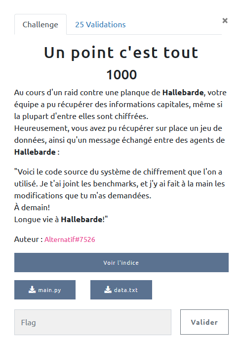

## CRYPTANALYSE / Un point c'est tout

<p align="center">
  
</p>


### Look around


Le challenge nous fournit deux fichiers :
- [main.py](main.py) : code utilisé pour chiffrer le flag et réaliser tout un tas de benchmarks selon l'énoncé
- [data.txt](data.txt) : le résultat du script précédent.

Pas mal d'indices / fausses pistes on fait que j'ai un peu tourné en rond.

##### Les benchmarks

Effectivement, on a les temps mis pour chiffrer, déchiffrer chacun des 200 messages de test ... Mais à part (et encore en s'énervant) obtenir une approximation du nombre de bit à 1 dans la clef privée `d`, je me suis assez rapidement dit que ça ne servirait pas.

##### Le code modifié

Le code fournit tel quel ne peut pas produire l'output correspondant :

```python
def gen_benchmarks( public_key, private_key, f):
    for i in range(200):
        r = getRandomRange(2, N)
```

Provoque une erreur, en effet N n'est ni passé ni récupéré dans la fonction.

```python
f.write(f'cipher: hex(encrypted_flag)')
```

Ne fait qu'écrire la chaine de caractère `cipher: hex(encrypted_flag)` dans le fichier, il manque les balises de format string.

Ceci dit, même en envisageant des tas de modifications qui ont pu être apportée, je n'ai pas trouvé de problème triviaux (flag signé et non chiffré, clef privée inscrite dans le fichier, etc).


### Just a GCD ...

A force de tourner autour des données, je me suis intéressé aux 200 couples (clair, chiffré) que l'on nous donne gentiment.

Tout d'abord pour vérifier que chaque clair chiffré avec (e,N) redonne bien le chiffré du fichier.

Ensuite tout ce qui m'est passé par la tête, surtout pour chercher infructueusement un lien entre l'un des clairs ou chiffrés avec le flag.

Finalement, un test tout simple m'a mis la puce à l'oreille :

```python
for p in plain:
    if p in encrypted:
        print(p)
```

Et là surprise on a un clair tel que : `p = p^e [N]`, autrement dit `p` est invariant par le chiffrement avec (e,N).

Un peu de ressources :
- [FINDING CASES OF CIPHERTEXT EQUAL TO PLAINTEXT IN THE RSA ALGORITHM](https://shareok.org/bitstream/handle/11244/10269/Sadr_okstate_0664M_11533.pdf)
- https://crypto.stackexchange.com/questions/99059/plaintext-message-equals-the-encrypted-message

Pour éviter les confusion, on va appeler ce point `p` un `hole`

 `hole = hole^e [N]` signifie  (parce qu'il est non nul et différent de 1) qu'il est solution de :

 `x = 0 [p]` ou `x = 0 [q]` avec p,q les entiers premiers générateurs de N.

 Il existe donc `k` tel que `hole = k * q` (ou p, on fixe celui que l'on veut).

Bien sûr `q` est premier par définition et `N = p * q`, on a donc `q = gcd(hole, N)`

A partir de là, c'est bon, on retrouve `p` et `q`, on recalcule `d` puis on déchiffre le flag.

```python3

p = GCD(hole, N)
q = N//p

d = inverse(e, (p-1)*(q-1))

f = pow(flag,d,N)

print(unhexlify(hex(f)[2:]))
```

`b"404CTF{L35_p01n75_f1x35_C'357_7r35_b13n}"`
