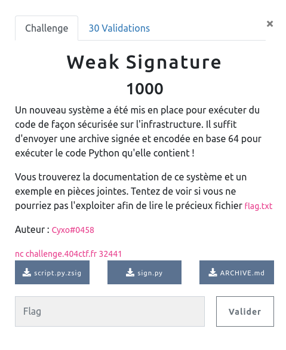

## CRYPTANALYSE / Weak Signature

<p align="center">
  
</p>


### Look around


Le challenge nous fournit trois fichiers :
- [sign.py](sign.py) : code utilisé pour la signature
- [script.py.zsig](script.py.zsig) : un exemple de code signé que l'on peut exécuter sur le serveur
- [ARCHIVE.md](ARCHIVE.md) : le mode d'emploi et spécifications


La signature d'un fichier est (presque) classique :
- `hash` du fichier
- `signature`du hash (c'est à dire chiffrement avec la clef privée)
- concaténation de la signature avec le fichier, ici en respectant quelques spécifications d'entêtes


Heu ... `hash` vraiment ?

```python
def checksum(data: bytes) -> int:
    # Sum the integer value of each byte and multiply the result by the length
    chksum = sum(data) * len(data)

    return chksum


def compute_signature(data: bytes, private_key: int, mod: int) -> int:
    # Compute the checksum
    chksum = checksum(data)
    # Sign it
    signature = pow(chksum, private_key, mod)

    return signature
```

En lieu de hash il s'agit simplement d'un checksum maison !


### Exploit

En regardant d'un peu plus près le fichier d'exemple (valide puisque déjà signé ...) :

```bash
$ xxd script.py.zsig
00000000: 015a 5369 6702 0000 0000 0000 0000 0000  .ZSig........... <= header
00000010: 0000 0000 0000 0000 0000 0000 0000 0000  ................
00000020: 0000 0000 0000 0000 0000 0000 0000 0000  ................
00000030: 0000 00db c3e3 7c11 3bb1 a165 e4e2 f36c  ......|.;..e...l <= signature
00000040: 2a40 6c8f ac5e 52b7 7e95 1214 7e4a ea85  *@l..^R.~...~J..
00000050: c130 5a39 c8df 0e79 3788 85d1 99c8 42c6  .0Z9...y7.....B.
00000060: a206 ba04 aa6b 73b0 782f a171 4242 91b1  .....ks.x/.qBB..
00000070: 0e77 b513 897a a119 b400 bb51 9361 6408  .w...z.....Q.ad.
00000080: ea49 29ed 7f23 80bc 3c82 9df3 a832 cd47  .I)..#..<....2.G
00000090: 1764 285a 822c 9c75 d9f8 4f5b 6c18 c910  .d(Z.,.u..O[l...
000000a0: 87b5 2602 c3d9 b60e 4528 d468 edf8 d9d3  ..&.....E(.h....
000000b0: 01a0 984e 9a2a 420d 0527 7f0c 6dc4 ee63  ...N.*B..'..m..c
000000c0: 86ed 1e50 9bf2 1f56 d54f d654 d0ad 4dc4  ...P...V.O.T..M.
000000d0: 7582 591d 6cfc fe8b f347 f432 e0a3 208e  u.Y.l....G.2.. .
000000e0: a455 5714 f8ce 3bc9 248a a1c3 5c40 ffa8  .UW...;.$...\@..
000000f0: 6d5a 275c b57b 2f9d 9af5 e524 f4db 5589  mZ'\.{/....$..U.
00000100: 382c b792 8890 0137 4c22 d42b 562d d7f0  8,.....7L".+V-..
00000110: e733 c17b b37d 8fca b396 80c0 c9d9 fe2a  .3.{.}.........*
00000120: fd4c 1ea2 2caa 3e83 e4eb 7050 9211 164e  .L..,.>...pP...N
00000130: 773e 0300 0000 7a04 2320 5468 6973 2069  w>....z.# This i <= fin signature / taille / code
00000140: 7320 6120 6465 6d6f 2073 6372 6970 742e  s a demo script.
00000150: 2049 7420 646f 6573 6e27 7420 646f 206d   It doesn't do m
00000160: 7563 682c 2062 7574 2049 206c 696b 6520  uch, but I like
00000170: 6974 2e20 596f 7520 6361 6e20 7573 6520  it. You can use
00000180: 6974 2074 6f6f 2069 6620 796f 7520 7761  it too if you wa
00000190: 6e74 203a 440a 0a70 7269 6e74 2822 4865  nt :D..print("He
000001a0: 6c6c 6f2c 2043 5446 2070 6c61 7965 7221  llo, CTF player!
000001b0: 2229
```
Mais comme la signature est calculée sur uniquement `somme(code) * taille(code)`, si on remplace dans ce fichier le code déjà présent par un code de même longeur et dont la somme vaut la même chose .... on aura un deuxième script valide !

En tatonnant un peu pour trouver le bon padding :

```python
target_size = 0x7a
target_sum = 0x2791
target_check = target_size * target_sum

payload = b"print(open('flag.txt').read()) #"
payload += b"S" * (target_size-len(payload) - 2)
payload += b"Z"
payload += b"Z"

print(hex(len(payload)))

sum = 0
for c in payload:
    sum +=c

print(hex(sum))


with open("script.py.zsig","rb") as fi, open("script2.py.zsig","wb") as fo:
    for i in range(0x138):
        fo.write(fi.read(1))
    fo.write(payload)
```


```bash
$ xxd script2.py.zsig   
00000000: 015a 5369 6702 0000 0000 0000 0000 0000  .ZSig...........
00000010: 0000 0000 0000 0000 0000 0000 0000 0000  ................
00000020: 0000 0000 0000 0000 0000 0000 0000 0000  ................
00000030: 0000 00db c3e3 7c11 3bb1 a165 e4e2 f36c  ......|.;..e...l
00000040: 2a40 6c8f ac5e 52b7 7e95 1214 7e4a ea85  *@l..^R.~...~J..
00000050: c130 5a39 c8df 0e79 3788 85d1 99c8 42c6  .0Z9...y7.....B.
00000060: a206 ba04 aa6b 73b0 782f a171 4242 91b1  .....ks.x/.qBB..
00000070: 0e77 b513 897a a119 b400 bb51 9361 6408  .w...z.....Q.ad.
00000080: ea49 29ed 7f23 80bc 3c82 9df3 a832 cd47  .I)..#..<....2.G
00000090: 1764 285a 822c 9c75 d9f8 4f5b 6c18 c910  .d(Z.,.u..O[l...
000000a0: 87b5 2602 c3d9 b60e 4528 d468 edf8 d9d3  ..&.....E(.h....
000000b0: 01a0 984e 9a2a 420d 0527 7f0c 6dc4 ee63  ...N.*B..'..m..c
000000c0: 86ed 1e50 9bf2 1f56 d54f d654 d0ad 4dc4  ...P...V.O.T..M.
000000d0: 7582 591d 6cfc fe8b f347 f432 e0a3 208e  u.Y.l....G.2.. .
000000e0: a455 5714 f8ce 3bc9 248a a1c3 5c40 ffa8  .UW...;.$...\@..
000000f0: 6d5a 275c b57b 2f9d 9af5 e524 f4db 5589  mZ'\.{/....$..U.
00000100: 382c b792 8890 0137 4c22 d42b 562d d7f0  8,.....7L".+V-..
00000110: e733 c17b b37d 8fca b396 80c0 c9d9 fe2a  .3.{.}.........*
00000120: fd4c 1ea2 2caa 3e83 e4eb 7050 9211 164e  .L..,.>...pP...N
00000130: 773e 0300 0000 7a04 7072 696e 7428 6f70  w>....z.print(op
00000140: 656e 2827 666c 6167 2e74 7874 2729 2e72  en('flag.txt').r
00000150: 6561 6428 2929 2023 5353 5353 5353 5353  ead()) #SSSSSSSS
00000160: 5353 5353 5353 5353 5353 5353 5353 5353  SSSSSSSSSSSSSSSS
00000170: 5353 5353 5353 5353 5353 5353 5353 5353  SSSSSSSSSSSSSSSS
00000180: 5353 5353 5353 5353 5353 5353 5353 5353  SSSSSSSSSSSSSSSS
00000190: 5353 5353 5353 5353 5353 5353 5353 5353  SSSSSSSSSSSSSSSS
000001a0: 5353 5353 5353 5353 5353 5353 5353 5353  SSSSSSSSSSSSSSSS
000001b0: 5a5a                                     ZZ
```


```bash
$ (cat script2.py.zsig| base64 | tr -d '\n'; cat) | nc challenge.404ctf.fr 32441
Send me a signed archive encoded in base 64:

404CTF{Th1s_Ch3cksum_W4s_Tr4sh}
```

### L'implémentation d'algorithmes cryptographiques "maison" est une très mauvaise idée !!
