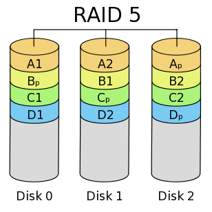

## FORENSIC / Raid [1/2]

<p align="center">
  
</p>


### Look around

Le challenge nous fournit deux images de disques, ainsi qu'un fichier texte :

```
Type de RAID : 5
Taille des blocs : 1 octet

https://fr.wikipedia.org/wiki/RAID_(informatique)#RAID_5_:_volume_agr%C3%A9g%C3%A9_par_bandes_%C3%A0_parit%C3%A9_r%C3%A9partie
```

D'après le fichier `manuel.txt` les données extraites proviennent d'un système monté en RAID 5, et le lien vers wikipedia nous fournit toutes les informations nécessairese.

On peut rapidement regarder à quoi ressemblent les données :

```bash
$ xxd disk1.img | head
00000000: 4b07 1400 0806 5400 0000 0032 0008 206c  K.....T....2.. l
00000010: 062e 7401 0d2c aa62 824e 2875 7300 0000  ..t..,.b.N(us...
00000020: 0000 0033 717f abf4 fd37 2ea7 2f8e 0632  ...3q....7../..2
00000030: 4ffe 2d2c 198e 4c7f 3130 004e 001b 0795  O.-,..L.10.N....
00000040: d634 0032 004b 0714 0008 3254 0000 0000  .4.2.K....2T....
00000050: a700 1220 6c06 5f72 2d70 645e 6e54 0d07  ... l._r-pd^nT..
00000060: 6e69 cce0 8462 0b01 0400 0400 0076 55cf  ni...b.......vU.
00000070: b621 84c2 0518 363c 0400 0832 6001 bbb0  .!....6<...2....
00000080: e083 006b c102 7f57 2fbf 55a2 8bbb d677  ...k...W/.U....w
00000090: a140 9250 e150 a461 545e 3941 7a04 828a  .@.P.P.aT^9Az...

xxd disk0.img | head
00000000: 5003 1408 0862 b000 0000 0032 0008 2066  P....b.....2.. f
00000010: 615a 7855 0d07 284f 2862 aa62 7801 0400  aZxU..(O(b.bx...
00000020: 0400 0002 300e a572 74ba 372e 1f29 2f1c  ....0..rt.7..)/.
00000030: 8e36 e531 2cb9 4c4a 02b3 4de5 0550 0f3f  .6.1,.LJ..M..P.?
00000040: 6834 0032 0050 0314 0808 80a1 0000 0000  h4.2.P..........
00000050: 5600 1220 6661 3c30 7204 332e 0955 0de7  V.. fa<0r.3..U..
00000060: ea62 bb62 ea17 7800 0400 0000 00ec 065c  .b.b..x........\
00000070: 1b25 0840 2248 26d4 c077 e6ee 6883 bb07  .%.@.H&..w..h...
00000080: 4e03 bb0b d0e6 11ce 3834 dd4f d6d5 7b82  N.......84.O..{.
00000090: db4a fd50 b0c0 6fa5 0450 7ec0 ff85 00f2  .J.P..o..P~.....

$ ls -la
-rw-r--r-- 1 maskott maskott 27756 18 mai   19:58 disk0.img
-rw-r--r-- 1 maskott maskott 27756 18 mai   19:58 disk1.img

`̀``


Les deux images disques font exactement la même taille, par ailleurs les entêtes ne font pas penser à un MBR de disques.

On peut donc faire l'hypothèse que nous avons les fragments d'un fichier réparti sur plusieurs disque (RAID5), et dans le cas présent 2 disques sur les 3 qui seraient montés en RAID 5.

Par ailleurs, la configuration précise que les blocs font 1Mb, ce qui va faciliter la reconstitution.

### SOLUTION

Avec les hypothèses précédentes, on a donc pour notre fichier, disons que l'on a perdu le disk2 :

<p align="center">
  
</p>

Les `Ap Bp Cp ....` sont simplement le xor des deux blocs correspondants

`Ap = A1 xor A2 etc ...`

Pour reconstituer le fichier, il faut récupérer dans l'ordre : `A1, A2, B1, B2, C1, C2, ...`


Ce qui donne le code suivant :

```python

with open("disk0.img", "rb") as d1, open("disk1.img","rb") as d2, open("out","wb") as out:
	data1 = d1.read()
	data2 = d2.read()
	res = b''

	for i in range(0,len(data1),3):

		out.write( data1[i].to_bytes(1,byteorder='big' ) )
		out.write( data2[i].to_bytes(1,byteorder='big' ) )

		out.write( data1[i+1].to_bytes(1,byteorder='big' ) )
		out.write( (data1[i+1]^data2[i+1]).to_bytes(1,byteorder='big') )


		out.write( data2[i+2].to_bytes(1,byteorder='big' ) )
		out.write( (data1[i+2]^data2[i+2]).to_bytes(1,byteorder='big') )
```

Finalement le fichier de sortie est une archive contenant le flag et un `png` corrompu (voir raid[2/2])


`404CTF{RAID_5_3st_p4s_tr3s_c0mpl1qu3_1abe46685ecf}`
