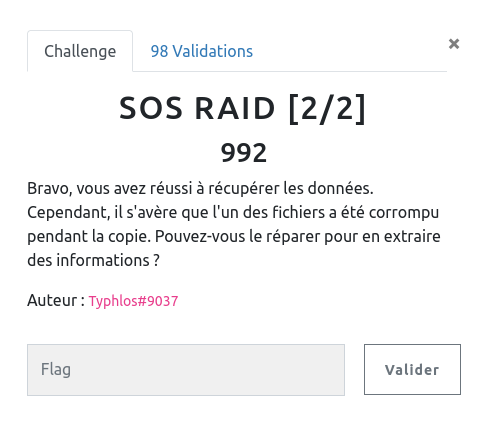
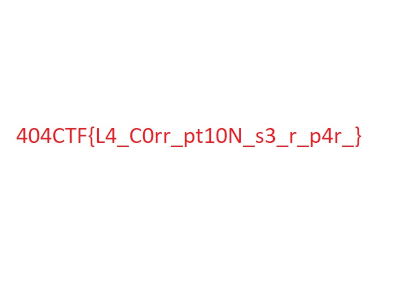

## FORENSIC / Raid [2/2]

<p align="center">
  
</p>


### Look around

Il s'agit de la suite de Raid [1/2] où nous avions pu récupérer un fichier `png` corrompu.

```bash
xxd flag_c0rr_pt3d.png | head -n 50
00000000: 8950 4e47 0d00 000a 0000 ff0d 4948 4452  .PNG........IHDR
00000010: 0000 0480 0000 f288 0806 0000 0008 2b81  ..............+.
00000020: 0d00 0000 0173 5247 4200 aece 1ce9 0000  .....sRGB.......
00000030: 0004 6741 4d41 0000 b18f 0bfc 6105 0000  ..gAMA......a...
00000040: 0009 7048 5973 0000 0ec4 0000 0ec4 0195  ..pHYs..........
00000050: 2b0e 1b00 00f1 3c49 4441 5478 5eec fd65  +.....<IDATx^..e
00000060: 9c1e c799 ee01 bf5f df0f efef 9c3d 67b3  ......._.....=g.
00000070: 892d 1866 1e31 98ed 30c7 b1e3 38bc bb67  .-.f.1..0...8..g
00000080: 318c 7612 c781 3d59 0a39 c6d8 8903 1bb2  1.v...=Y.9......
00000090: 6346 996d 31cc 8879 a4d1 68a4 1133 e3f5  cF.m1..y..h..3..
000000a0: 5ed7 5ddd cf3c 233b bbc9 289b d8cf b9fe  ^.]..<#;..(.....
000000b0: 524d 7757 57dd c5d5 55f7 535d fdff 8131  RMwWW...U.S]...1
000000c0: c618 638c 31c6 1863 8c29 69ac 0032 c618  ..c.1..c.)i..2..
000000d0: 638c 31c6 1863 8c29 71ac 0032 c618 638c  c.1..c.)q..2..c.
```

On retrouve des chuncks du format `png` :
- PNG
- IHDR
- sRGB
- gAMA
- pHYs
- IDAT

Et avec un peu de lecture (http://www.libpng.org/pub/png/spec/1.2/PNG-Structure.html) on comprend comment ces chuncks sont organisés :

- header de fichier `png` : `137 80 78 71 13 10 26 10 => 89 50 4e 47 0d 0a 1a 0a` (en hexa)

- plusieurs chuncks sous la forme suivante :

`chuncks_size (4 octets)` | `chuncks_name (4 octets)` | `chuncks_data (chuncks_size octets)` | `CRC (4 octets)`

Avec la condition sur le CRC qui est calculé sur le nom + la data


### SOLUTION

Avant de corriger le fichier du challenge, j'ai récupéré un `PNG` valide, pour vérifier à la main ces informations et notamment le calcul du CRC.

Pour ce dernier j'utilise [CyberChef](https://gchq.github.io/CyberChef/#recipe=From_Hex('Auto')CRC-32_Checksum()) avec les bonnes briques :
- From Hex
- CRC32 Checksum


Et effectivement cela convient pour le calcul du CRC.


Il suffit alors de prendre notre fichier corrompu :
- corriger l'entête PNG
- pour chaque chunck : vérifier la taille, recalculer le CRC

Et modifier le fichier au fur et à mesure dans un éditeur hexadécimal par exemple.

Sans oublier le chunck de fin (`IEND`) qui est lui aussi décalré avec une taille de data nulle et suivit d'un CRC.


Après cela, notre fichier s'ouvre correctement et affiche le flag :


<p align="center">
  
</p>
