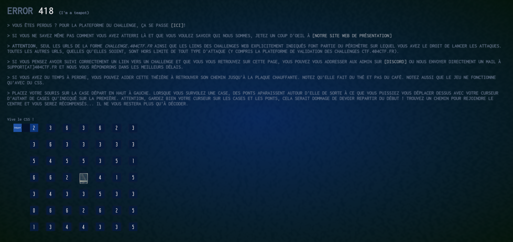

## MISC / Je suis une théière

  

### Look around

Le titre fait penser à un obscur protocole over HTTP, naît d'un poisson d'avril mais devenu une véritable RFC et implémenté par certains serveurs :

https://fr.wikipedia.org/wiki/Hyper_Text_Coffee_Pot_Control_Protocol

Ceci dit c'est une demi fausse piste ... après plein de requête respectant le format de la [RFC](https://tools.ietf.org/html/rfc2324), je me suis simplement rendu compte qu'il fallait juste interroger le bon enpoint sur le site du ctf :

https://teapot.404ctf.fr/

  

### Solve the maze

En jouant un peu avec le casse-tête, on voit qu'il faut trouver le chemin menant au centre, saut par saut.

Comme précisé, tout cela est codé en CSS ... il y a peut être un moyen de trouver la solution en étudiant le code, mais je suis nul en web. Ceci dit un petit tour dans les fichiers sources fournit une indication précieuse :

`Bravo ! Je vais pouvoir me faire du thé. Au fait, avez-vous noté les caractères qui sont apparus sur la plaque de cuisson au fur et à  mesure du chemin ? Ce serait dommage de devoir tout refaire...`

Effectivement au fur et à mesure de l'avancée des lettres apparaissent au centre, ce qui doit fournir le flag.

Donc, on peut supposer que le chemin est unique et qu'il est plus simple de le faire à l'envers, sens dans lequel on aura qu'une route possible.

En partant du centre, on cherche la case dont la valeur est à la bonne distance :à
- aucune dans le premier cercle
- aucune dans le 2e cercle
- 1 case avec la valeur 3 dans le 3e cercle.

Il suffit alors de remonter petit à petit de saut en saut, puis de tout refaire dans le bon sens pour récupérer des morceaux de base 64.

Le tout décodé donnant le flag.
