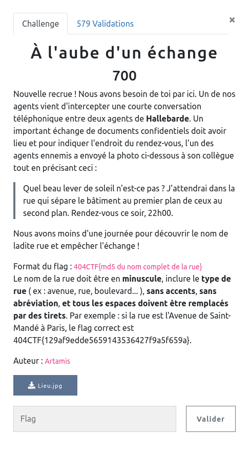
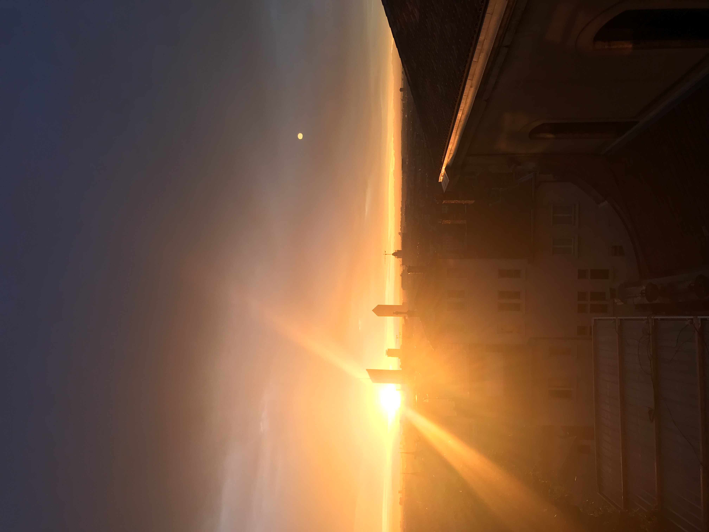
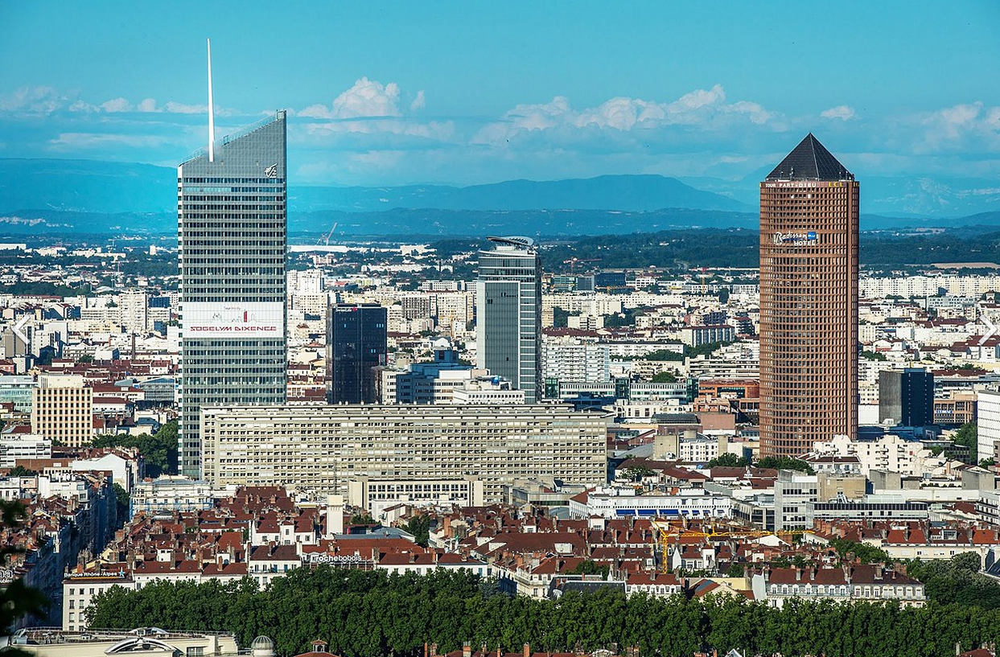
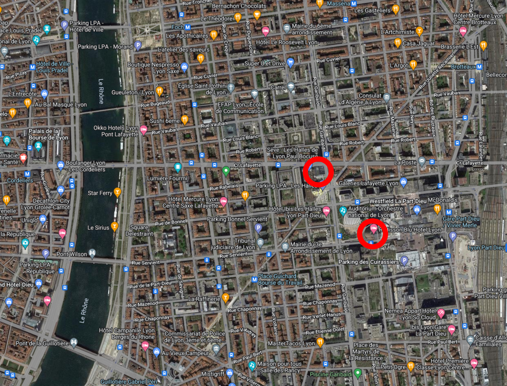
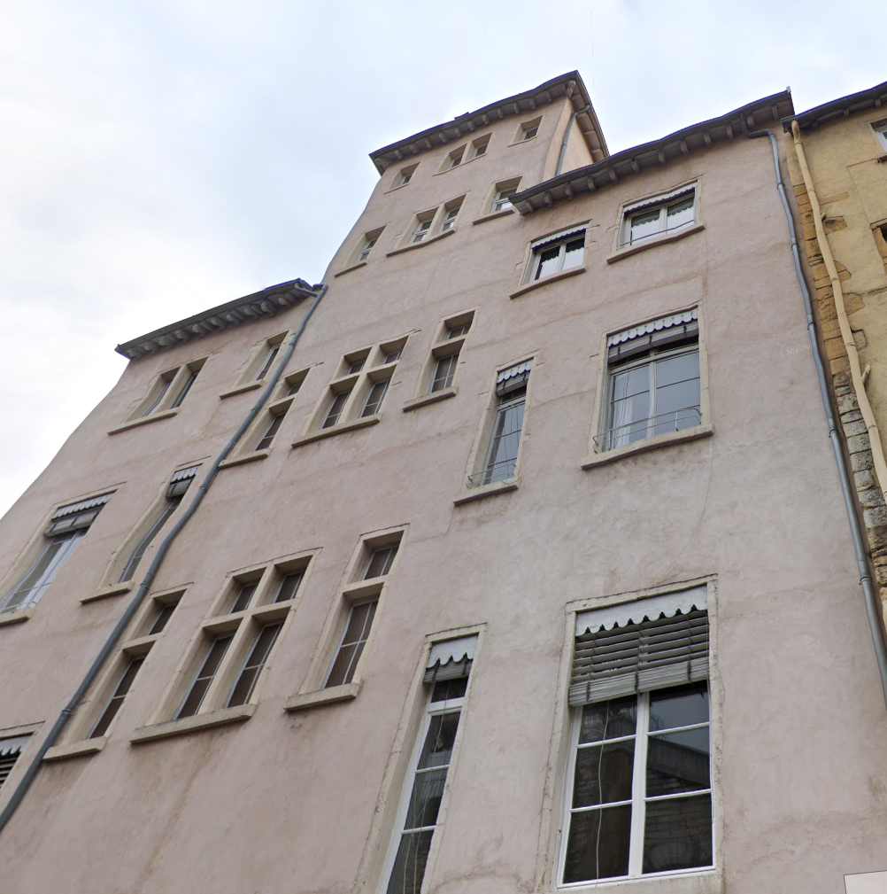

## OSINT / A l'aube d'un échange

  

### Look around

Il s'agit d'un challenge d'OSINT, et plus exactement de retrouver une localisation à partir d'une photo.

  

### Google my friend ...

A première vue :
- nous sommes dans une grande ville
- le second plan montre quelques bâtiments caractéristiques
- le premier plan un bord de toit de ce qui pourrait être une église
- face à nous une façade reconnaissable

Fort de ces quelques informations, et en supposant que nous sommes en France (thème du ctf), il suffit de rechercher `building France` pour tomber dès le premier résultat sur une photo évocatrice :

  

Et nous apprenons de nouvelles choses :
- nous sommes à Lyon
- plutôt à l'Ouest de la ville
- la tour de gauche est la `Caisse d'épargne`
- la tour de droite le `Radisson Hotel`

On positionne tout ça sur une map :

  

Maintenant la partie un peu plus tricky .... Sur la photos d'origine du challenge on peut remarquer deux clochers en pointe en second plan à gauche derrière les rayons de soleil.

Avec quelques recherches sur google :
- Lyon monuments historiques
- Lyon monuments
- Lyon églises

On trouve qu'il s'agit de l'église Saint Nizier.

Y a plus qu'à la placer à son tour sur la carte :

  

Il y a désromais de bonnes chances que la photo soit prise depuis la coline de Fourvière à l'Ouest de Lyon et de la Saône.

En recherchant `Lyon Fourvière panorama` on est vite confortés dans cette idée.

Si on regarde le versan Est de la colline de Fourvière, on remarque deux belles `montées`, orientées comme il faut.

On peut alors soit les parcourir en street view, ou rechercher des bâtiments ressemblant au premier plan de notre challenge.

Finalement au 24 de la montée Saint Barthelemy :

  

