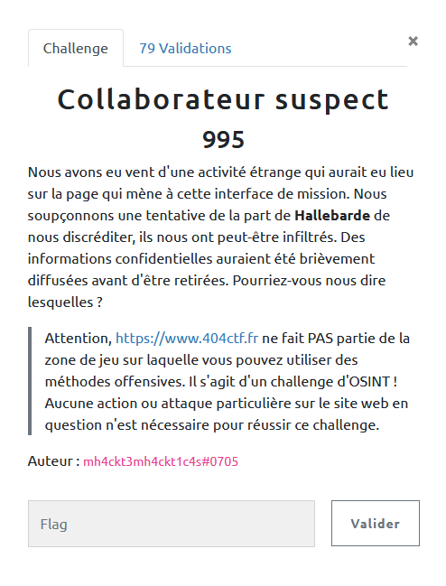
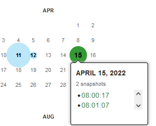
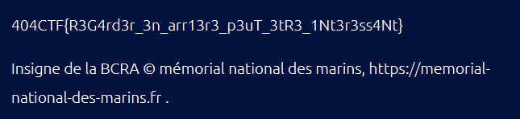

## OSINT / Collaborateur suspect

  

### Look around

Apparemment le site a subit une altération par le passé ....

Cela nous fait immédiatement penser à l'excellent `WayBackMachine`, sur lequel on cherche l'url du CTF : `https://www.404ctf.fr/`

Et on identifie alors des sauvegardes effectuées par le crawler (ou les organisateurs du challenge ...)

  

Il y a plus qu'à naviguer sur les sauvegardes, pour arriver sur (un peu caché quand même !) :

https://web.archive.org/web/20220411084948/https://www.404ctf.fr/credit.html

  

