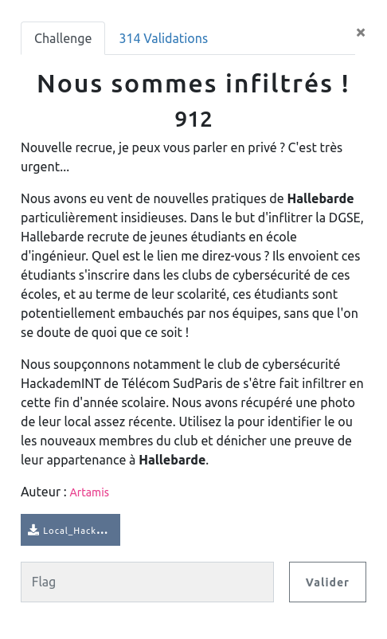
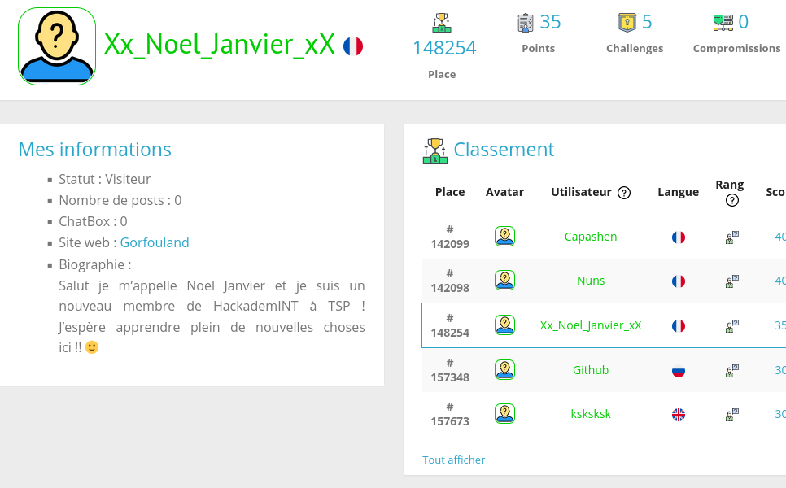
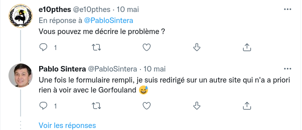
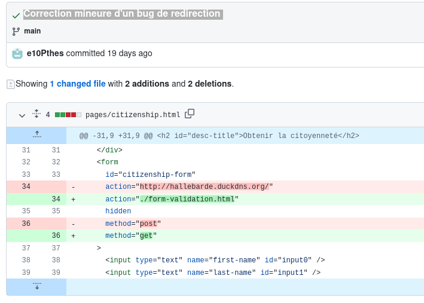
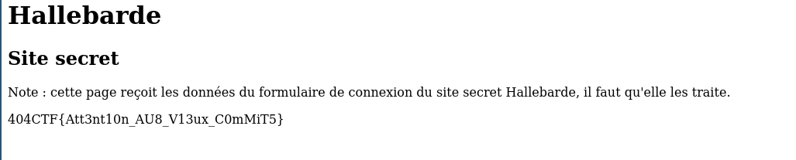

## OSINT / Nous sommes infiltrés

  

### Look around

Le challenge nous fournit la liste du club de cybersécurité HackademINT de Télécom SudParis, en tous cas leurs pseudos sur `Root Me`

  

Après un petit tour sur Root-Me, l'un des comptes semble faire tâche dans la bande :

`Xx_Noel_Jnvier_xX`

  

Sur ce profil on trouve du coup un lien vers un site plutôt bizzare : https://e10pthes.github.io/about/

Et sur ce même site le compte Twitter de son créateur : https://twitter.com/e10pthes

En parcourant le fil Twitter, principalement consacré au développement du site précédent et à la citoyenneté du Gorfouland, on note qu'un problème technique a été reporté et apparemment corrigé :

  

Heureusement pour nous le site est hébergé sur github.io, en gros c'est un repo git, y'a plus qu'à s'y rendre :

https://github.com/e10pthes

Puis

https://github.com/e10Pthes/about

Le dernier commit a été judicieusement commenté : `Correction mineure d'un bug de redirection `

En regardant les correction apportées dans les sources on récupère l'URL compromettante?

  

http://hallebarde.duckdns.org/

Et voilà, on a la preuve :

  

Et oui, le flag a raison, attention avec les commits surtout pour un repo public !!
