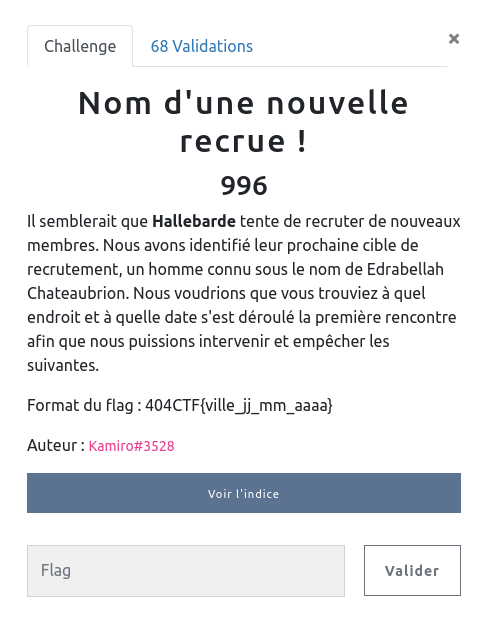

## OSINT / Nom d'une nouvelle recrue

<p align="center">
  
</p>


### Look around

Ce challenge m'a un peu laissé circonspect, ne sachant pas trop par où l'attaquer.
D'ailleurs, on se rend rapidement compte que le seul indice `Edrabellah Chateaubrion` ne correspond à rien, et est de plus en plus recherché sur Google, qui remonte des tas de pages par association ... sûrement les recherches des autres joueurs !


Finalement c'est par les Google dorks que j'ai pu débuter :

`intext: Edrabellah`

Donne des résultats, en particulier plusieurs commentaires d'un certain `Edrabellah Hälbeardt` sur des lieux qu'il a visité.


Au fur et à mesure des commentaires nous apprenons plusieurs choses :


- visite d'Orcines avec sa fiancée en avril
- voyage avec sa future épouse en mars
- lune de miel à la Martinique en mai
- probable mariage à Clermont-Ferrand en avril (où il aurait pris le nom de sa femme ... `Chateaubrion` probablement)


### Post d'intérêt

Le post le plus intéressant se révèle être celui du voyage en mars :

``̀
Terminal 2E - Portes K

Charles de Gaulle est un aéroport toujours trop animé à mon goût, je préférais le Covid ! Il est vraiment difficile de s'y retrouver lorsque plus d'un terminal est ouvert. Hâte de découvrir enfin l'organisation de ma future épouse !  Le vol a eu du retard, mais nous avons pu patienter avec un verre au bar. Pas de pluie, un bon début de mois de mars ! En route vers le soleil et une rencontre qui s'annonce pleine d'énergie !
```

Qui s'accompagne d'une photo :

<p align="center">
  
</p>


Nous trouvons là tout les indices nécessaires :
- début mars
- vol du F-GRHL au départ de CDG
- pour aller rencontrer une organisation ....


Sur https://www.airfleets.fr nous trouvons alors un vol correspondant :

<p align="center">
  
</p>


Malgré davantage de recherche je n'ai pas trouvé de quoi confirmer un quelconque rendez-vous à Malaga

Au final, le flag est bien `404CTF{malaga_07_03_2022}`
