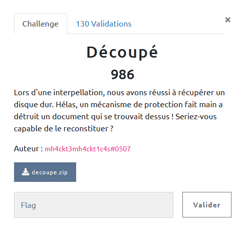
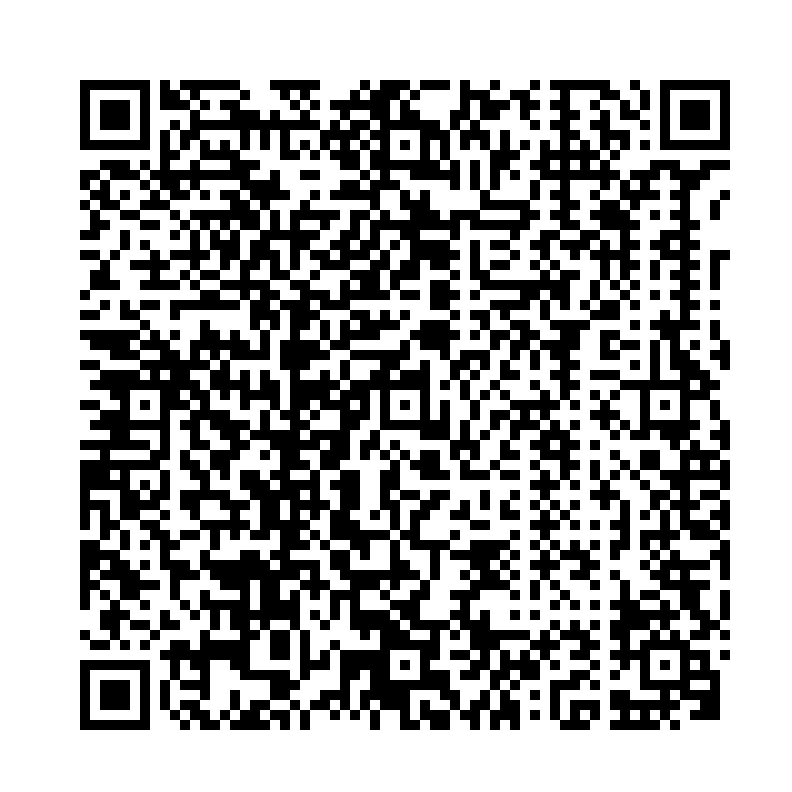

## MISC / Pierre Papier Hallebarde

<p align="center">
  
</p>


### Look around

Nous avons à notre disposition un ficher zip qui contient 576 petites images png.

Il suffit de regarder dans un navigateur de fichier pour comprendre qu'il s'agit d'une grande image morcelée (a priori un QRCode).

### Solve

Il s'agit donc de recoller les morceaux ...

Oh chance ! 576 = 24 x 24

On peut se dire que l'on a 24 lignes à reconstruire, puis à assembler pour l'image finale.

Pour cela on va supposer (en regardant un peu les vignettes quand même) que les morceaux 1 à 24 constituent la 1re ligne, et ainsi de suite.

En utilisant l'outil `convert` installé avec `ImageMagick`

  - `+append` pour fusionner les images sur une même ligne
  - `-append` pour fusionner les images sur une même colonne

```bash
#!/bin/bash
convert +append {1..24}.png out-1.png
convert +append {25..48}.png out-2.png
convert +append {49..72}.png out-3.png
convert +append {73..96}.png out-4.png
convert +append {97..120}.png out-5.png
convert +append {121..144}.png out-6.png
convert +append {145..168}.png out-7.png
convert +append {169..192}.png out-8.png
convert +append {193..216}.png out-9.png
convert +append {217..240}.png out-10.png
convert +append {241..264}.png out-11.png
convert +append {265..288}.png out-12.png
convert +append {289..312}.png out-13.png
convert +append {313..336}.png out-14.png
convert +append {337..360}.png out-15.png
convert +append {361..384}.png out-16.png
convert +append {385..408}.png out-17.png
convert +append {409..432}.png out-18.png
convert +append {433..456}.png out-19.png
convert +append {457..480}.png out-20.png
convert +append {481..504}.png out-21.png
convert +append {505..528}.png out-22.png
convert +append {529..552}.png out-23.png
convert +append {553..576}.png out-24.png

convert -append out-{1..24}.png flag.png
```


Et cela nous donne bien le QRCode, il n'y a plus qu'à le lire pour le flag.

<p align="center">
  
</p>
