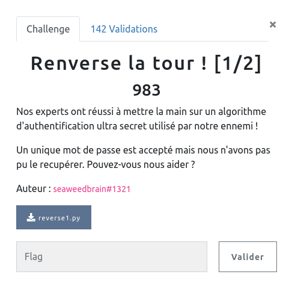

## REVERSE / Renverse la tour ! [1/2]

<p align="center">
  
</p>


### Look around

Le fichier du challenge contient trois fonctions, appellées successivement pour encoder notre mot de passe.

Il s'agit alors de trouver un password validant la condition :

```python
if tour3(tour2(tour1(mdp))) == "¡P‡6¨sÉU…1†Tƒ0•d¸VÊvçu©6„RÈx¨4xFw5":
```


### TODO

Il nous reste simplement à coder les fonctions inverse de ces trois fonctions pour calculer (dans le bon ordre ...):


```python
r_tour1(r_tour2(r_tour3(tour3(tour2(tour1(mdp))) ))) == r_tour1(r_tour2(r_tour3("¡P‡6¨sÉU…1†Tƒ0•d¸VÊvçu©6„RÈx¨4xFw5")))

mdp == r_tour1(r_tour2(r_tour3("¡P‡6¨sÉU…1†Tƒ0•d¸VÊvçu©6„RÈx¨4xFw5")))

```
### SOLUTION

En analysant une à une les fonctions (en particulier leurs entrées et sorties, ainsi que la taille des listes), on remarque quelques simplifications

- `tour1`inverse trois fois (donc une seule fois au final) notre password et retourne la liste des valeur décimales des caractères

- dans `tour2` : `int('qkdj', base=27) - int('QKDJ', base=31) + 267500 = 0`. Cette fonction prend une liste d'entiers entrée et retourne la même liste en intercalant entre deux entiers leur somme

- `tour3`reçoit une liste d'entiers et compose une chaîne de caractères (avec quelques opérations) en la construisant par les deux bouts à la fois


Il n'y a plus qu'à coder :


```python
def r_tour1(l):
    return "".join(chr(_) for _ in l[::-1])


def r_tour2(password):
    new = []
    for i in range(len(password)):
        if i % 2 == 0:
            new.append(password[password.index(password[i])])
    return new


def r_tour3(password):
    seed = ['l', 'x', 'i', 'b', 'i', 'i', 'q', 'u', 'd', 'v', 'a', 'v', 'b', 'n', 'l', 'v', 'v', 'l', 'g', 'z', 'q', 'g', 'i', 'u', 'd', 'u', 'd', 'j', 'o', 'r', 'y', 'r', 'u', 'a']
    mdp = [ord(c) for c in seed]

    for i in range(len(password)):
        mdp[i], mdp[len(password) - i -1 ] = (ord(password[len(password) - i -1 ]) - i % 4),  (ord(password[i]) - i % 4)

    return mdp


s = "¡P‡6¨sÉU…1†Tƒ0•d¸VÊvçu©6„RÈx¨4xFw5"

print(r_tour1(r_tour2(r_tour3(s))))

```

```bash
$ python3 sol.py
P4sS1R0bUst3Qu3C4
```
