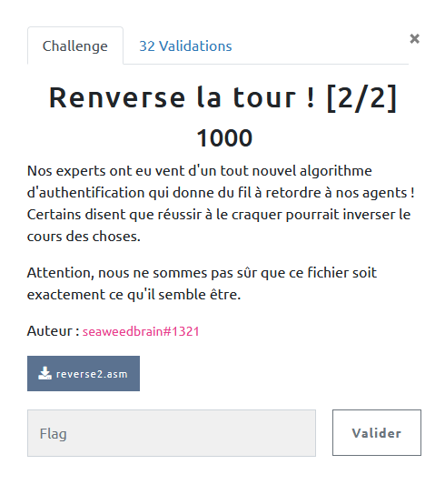

## REVERSE / Renverse la tour ! [2/2]

<p align="center">
  
</p>


### Look around

Nous pouvons télécharger un fichier `reverse2.asm` dont le nom est trompeur, puisqu'il s'agit d'un `.pyasm`, version textuel du bytecode python.

Un petit tour sur Google permet de découvrir quelques tools permettant de reconstituer du code python à partir du bytecode python (https://pypi.org/project/uncompyle6/) malheureusement dans notre cas, il faudrait générer le bytecode à partir du code pyasm puis le décompiler pour revenir au code source.

Cela semble possible : https://github.com/rocky/python-xasm

Cependant, notre fichier est un peu altéré, et il lui manque les entêtes ...

### Dive into pyasm

Rien n'est encore perdu, le code pyasm étant plutôt explicite et documenté en ligne.

Les instructions sont prises dans l'ordre et fonctionnent comme une pile.

Après quelques recherches, on note les fonctionnalités principales :


```
7          14 LOAD_CONST               2 ('')
           16 STORE_FAST               3 (p)
```

Prépare la valeur `''` puis la charge dans `p` : `p = ''`

```
3           0 LOAD_GLOBAL              0 (input)
            2 CALL_FUNCTION            0
            4 STORE_FAST               0 (inp)
```

Prépare la fonction `input()`, la variable `inp` puis réalise l'appel : `inp = input()`

Une instruction importante : `BINARY_SUBSCR` qui dépile deux valeurs de la pile.

```
126 LOAD_FAST                2 (n)
128 LOAD_FAST                7 (i)
130 BINARY_SUBSCR
```

Ainsi cela revient à `n[i]`, tout simplement l'indexage bien connu en python.


```
14     >>   46 LOAD_GLOBAL              2 (range)
            48 LOAD_GLOBAL              3 (len)
            50 LOAD_FAST                0 (inp)
            52 CALL_FUNCTION            1
            54 CALL_FUNCTION            1
            56 GET_ITER
       >>   58 FOR_ITER                32 (to 92)
            60 STORE_FAST               5 (k)

15          62 LOAD_FAST                2 (n)
            64 LOAD_FAST                0 (inp)
            66 LOAD_GLOBAL              4 (int)
            68 LOAD_GLOBAL              3 (len)
            70 LOAD_FAST                0 (inp)
            72 CALL_FUNCTION            1
            74 LOAD_FAST                5 (k)
            76 BINARY_SUBTRACT
            78 LOAD_CONST               5 (1)
            80 BINARY_SUBTRACT
            82 CALL_FUNCTION            1
            84 BINARY_SUBSCR
            86 INPLACE_ADD
            88 STORE_FAST               2 (n)
            90 JUMP_ABSOLUTE           58
```

Là on voit plus de choses, tout d'abord une boucle : `for k in range(len(inp))`

Puis en étudiant un peu le contenu, on arrive à :

```python
for k in range(len(inp)):
    n += inp[len(ip)-k-1]
```

En gros cela inverse l'input dans k.

Et ainsi de suite .... :

On réécrit les instructions suivantes:

```python
for i in range(len(inp)):
  p+= d[ord(n[i])]


for j in range(len(inp)):
  if f[j] != ord(p[j]):
    print("Nope !")
    exit 0
```

Finalement :

 - le programme prend un input (inp)
 - l'inverse (n)
 - les caractères de n servent alors d'index pour récupérer des valeurs dans un liste (d) et créer p
 - p doit être égal à f


 Il suffit d'écrire le processus inverse pour retrouver les bons index  :

```python
f=[88, 1, 140, 1, 203, 208, 89, 207, 132, 191, 178, 110, 138, 132, 210, 1, 140, 156, 138, 140, 191, 187, 89, 89, 187, 1, 208, 231, 161, 235, 178, 188, 187, 132, 187]

d= [159, 44, 176, 145, 103, 133, 49, 97, 113, 136, 184, 60, 85, 69, 64, 186, 182, 37, 56, 170, 19, 108, 152, 183, 41, 197, 252, 77, 35, 127, 198, 43, 148, 48, 46, 62, 15, 139, 95, 9, 38, 73, 160, 175, 226, 254, 129, 211, 132, 7, 90, 208, 187, 164, 158, 201, 116, 93, 54, 87, 126, 128, 16, 50, 244, 12, 4, 188, 166, 59, 235, 28, 199, 92, 216, 192, 231, 51, 61, 39, 220, 180, 204, 210, 178, 75, 17, 91, 143, 94, 34, 70, 222, 125, 131, 195, 33, 223, 242, 156, 232, 140, 67, 24, 111, 141, 162, 66, 45, 207, 138, 202, 89, 122, 191, 1, 110, 203, 241, 196, 82, 72, 76, 161, 117, 88, 105, 147, 119, 6, 157, 249, 168, 81, 32, 224, 237, 5, 146, 27, 80, 57, 42, 102, 172, 219, 114, 8, 31, 26, 238, 30, 212, 106, 221, 240, 118, 149, 165, 65, 83, 154, 151, 96, 36, 253, 250, 100, 74, 21, 189, 169, 239, 142, 173, 217, 181, 86, 29, 68, 155, 115, 225, 135, 0, 130, 101, 112, 206, 185, 227, 245, 18, 58, 243, 137, 20, 99, 3, 2, 233, 22, 55, 11, 13, 214, 84, 200, 47, 190, 205, 209, 53, 194, 229, 171, 248, 230, 109, 234, 236, 98, 213, 247, 150, 104, 79, 134, 71, 144, 25, 218, 107, 179, 124, 167, 251, 14, 78, 193, 40, 163, 123, 10, 246, 120, 23, 174, 63, 153, 228, 52, 121, 177, 215]

flag = ''
for i in range(len(f)):
    flag += chr(d.index(f[i]))
print(flag[::-1])
```

 `404CTF{L3s4pp4rencesS0ntTr0mp3uses}`
